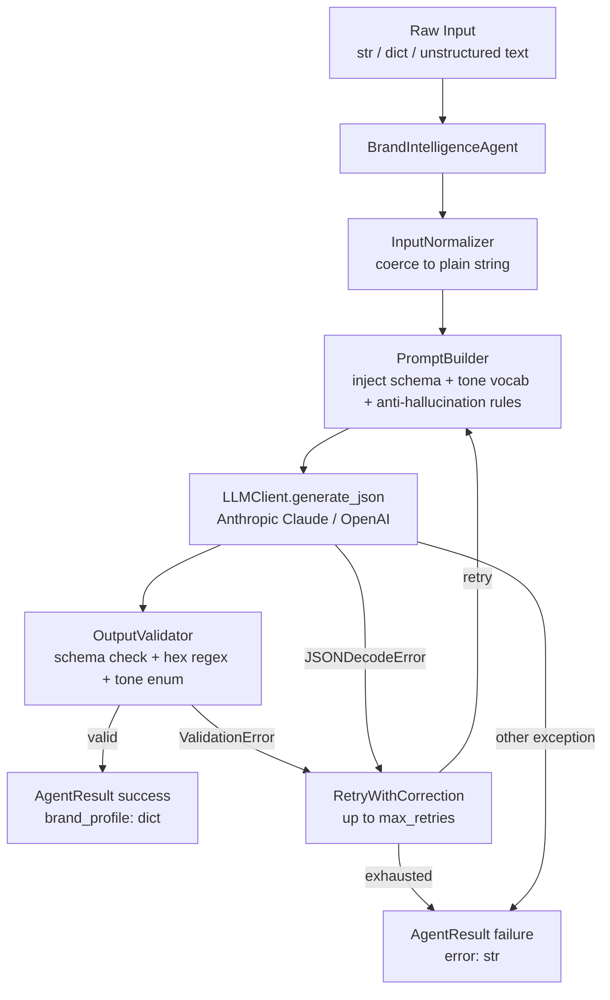
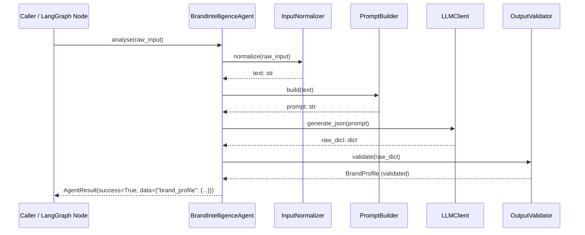
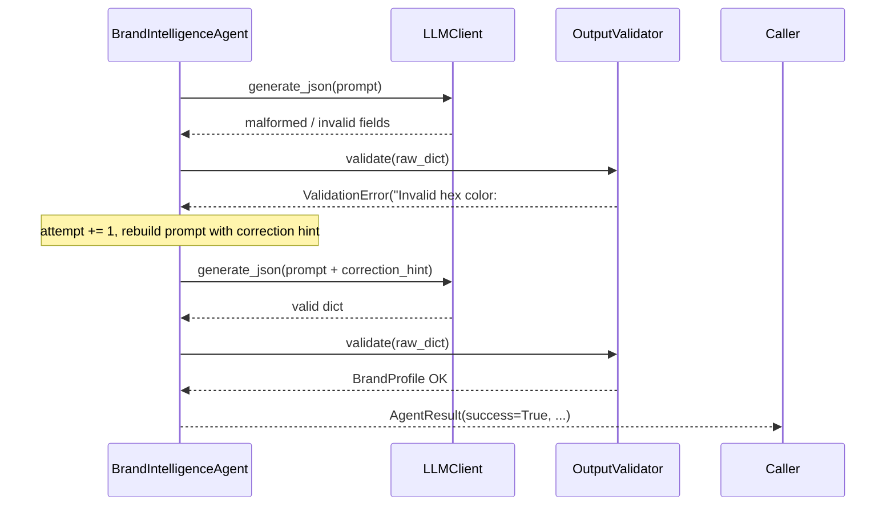

# Design Document: Brand Intelligence Agent

## Overview

The Brand Intelligence Agent is a LangGraph-compatible Python agent that analyses unstructured text
(social media posts, website copy, marketing content) and extracts structured brand identity signals:
dominant colors, communication tone, and visual style hints. It returns a strict, validated JSON
envelope that downstream agents (e.g. `PosterDesignDecisionAgent`) can consume directly as
`brand_colors` and tone context.

The agent follows the same `InputNormalizer → PromptBuilder → LLMClient → OutputValidator →
AgentResult` architecture used by `ContentExtractionAgent` and `PosterDesignDecisionAgent`, making
it a drop-in node in any LangGraph workflow. Its output is a `BrandProfile` dataclass with fields
`brand_colors: list[str]`, `tone: str`, and `style_notes: list[str]`.

---

## Architecture



---

## Sequence Diagrams

### Happy Path



### Retry / Failure Path



---

## Components and Interfaces

### Component 1: `BrandIntelligenceAgent`

**Purpose**: Orchestrates the full brand extraction pipeline; public API for callers and LangGraph nodes.

**Interface**:
```python
class BrandIntelligenceAgent:
    def __init__(self, dry_run: bool = False, max_retries: int = 2) -> None: ...

    def analyse(self, raw_input: str | dict) -> AgentResult:
        """
        Extract brand signals from raw_input.
        Returns AgentResult with data={"brand_profile": dict} on success.
        Never raises.
        """

    def run(self, state: dict) -> dict:
        """
        LangGraph node interface.
        Reads state["raw_brand_input"], writes state["brand_profile"] on success.
        Returns updated state dict in all cases.
        """
```

**Responsibilities**:
- Accept both string and dict inputs via `InputNormalizer`
- Coordinate the full pipeline: normalize → prompt → LLM → validate
- Implement retry loop (up to `max_retries`) with correction hints on `ValidationError`
- Increment retry counter on `json.JSONDecodeError`
- Return `AgentResult` immediately (no retry) on any other exception
- Never raise to the caller

---

### Component 2: `InputNormalizer`

**Purpose**: Converts any input shape into a clean prompt-ready string.

**Interface**:
```python
class InputNormalizer:
    def normalize(self, raw_input: str | dict) -> str:
        """
        - str  → strip() and return
        - dict → json.dumps() and return
        - None → raise ValueError
        - ""   → raise ValueError
        - {}   → raise ValueError
        Does not mutate the original input.
        """
```

**Responsibilities**:
- Handle `str` and `dict` inputs
- Raise `ValueError` with a descriptive message for `None`, empty string, or empty dict
- Never mutate the original input value

---

### Component 3: `PromptBuilder`

**Purpose**: Constructs LLM prompts with the output schema, tone vocabulary, and anti-hallucination
rules baked in.

**Interface**:
```python
class PromptBuilder:
    SYSTEM_PROMPT: str  # class-level constant

    def build(self, text: str) -> str:
        """
        Returns the full user prompt embedding text, output schema,
        valid tone values, and anti-hallucination instructions.
        """

    def build_with_correction(self, text: str, error_message: str) -> str:
        """
        Returns the base prompt with the previous error appended as a correction hint.
        """
```

**Responsibilities**:
- Embed the normalised input text in every prompt
- Include the exact output JSON schema (`brand_colors`, `tone`, `style_notes`)
- List all four valid tone values: `luxury`, `fun`, `minimal`, `corporate`
- Instruct the model to return empty values when confidence is low
- Instruct the model to return pure JSON — no markdown fences, no preamble
- Explicitly prohibit fabricating colors not present in the input text
- Append the previous error message as a correction hint when retrying

---

### Component 4: `OutputValidator`

**Purpose**: Validates the LLM's raw dict against the required schema and returns a `BrandProfile`.

**Interface**:
```python
class OutputValidator:
    VALID_TONES: frozenset[str]   # {"luxury", "fun", "minimal", "corporate"}
    REQUIRED_KEYS: frozenset[str] # {"brand_colors", "tone", "style_notes"}
    HEX_PATTERN: re.Pattern       # re.compile(r"#[0-9A-Fa-f]{3,6}")

    def validate(self, raw: dict) -> BrandProfile:
        """
        Raises ValidationError if any schema constraint is violated.
        Returns a populated BrandProfile on success.
        Does not mutate the input dict.
        """
```

**Responsibilities**:
- Reject non-dict inputs with `ValidationError`
- Check all three required keys are present
- Validate `brand_colors` is a list; each element matches `#[0-9A-Fa-f]{3,6}`
- Normalise `tone` to lowercase before validation
- Reject non-empty `tone` values not in `VALID_TONES`
- Validate `style_notes` is a list of strings
- Accept empty list for `brand_colors`, empty string for `tone`, empty list for `style_notes`
- Never mutate the input dict

---

## Data Models

### `BrandProfile`

```python
from dataclasses import dataclass, field

@dataclass
class BrandProfile:
    brand_colors: list[str]   # zero or more hex color strings
    tone:         str          # one of VALID_TONES or empty string
    style_notes:  list[str]   # zero or more style hint strings

    def to_dict(self) -> dict:
        return {
            "brand_colors": self.brand_colors,
            "tone":         self.tone,
            "style_notes":  self.style_notes,
        }
```

**Validation Rules**:
- `brand_colors` — list of strings each matching `#[0-9A-Fa-f]{3,6}` (empty list valid)
- `tone` — one of `{"luxury", "fun", "minimal", "corporate"}` or empty string `""`
- `style_notes` — list of strings (empty list valid)

### Output JSON Contract

```json
{
  "brand_colors": ["#hex1", "#hex2"],
  "tone":         "luxury | fun | minimal | corporate | \"\"",
  "style_notes":  ["string", "..."]
}
```

### `AgentResult` (existing)

```python
@dataclass
class AgentResult:
    success: bool
    data:    dict = field(default_factory=dict)
    error:   Optional[str] = None
```

On success: `data = {"brand_profile": {"brand_colors": [...], "tone": "...", "style_notes": [...]}}`

---

## Algorithmic Pseudocode

### Main Extraction Algorithm

```pascal
ALGORITHM analyse(raw_input)
INPUT:  raw_input of type str | dict
OUTPUT: result of type AgentResult

BEGIN
  // Step 1: Normalize — raises ValueError on empty/None
  TRY
    text ← InputNormalizer.normalize(raw_input)
  CATCH ValueError AS e
    RETURN AgentResult(success=False, error=str(e))
  END TRY

  // Step 2: Build initial prompt
  prompt ← PromptBuilder.build(text)

  // Step 3: Retry loop
  attempt ← 0
  WHILE attempt < max_retries DO
    TRY
      raw_dict ← LLMClient.generate_json(prompt)
      profile  ← OutputValidator.validate(raw_dict)
      RETURN AgentResult(success=True, data={"brand_profile": profile.to_dict()})
    CATCH ValidationError AS e
      attempt ← attempt + 1
      IF attempt < max_retries THEN
        prompt ← PromptBuilder.build_with_correction(text, str(e))
      END IF
    CATCH JSONDecodeError AS e
      attempt ← attempt + 1
    CATCH Exception AS e
      RETURN AgentResult(success=False, error=str(e))  // no retry
    END TRY
  END WHILE

  RETURN AgentResult(success=False, error="Extraction failed after max_retries attempts")
END
```

**Preconditions**:
- `raw_input` is a non-null, non-empty string or dict
- `LLMClient` is configured with a valid API key
- `max_retries` ≥ 1

**Postconditions**:
- On success: `result.data["brand_profile"]` contains exactly `brand_colors`, `tone`, `style_notes`
- On failure: `result.success = False` and `result.error` is a non-empty string
- No side effects on `raw_input`

**Loop Invariants**:
- `0 ≤ attempt ≤ max_retries` throughout the loop
- Each iteration either returns or increments `attempt`

---

### Validation Algorithm

```pascal
ALGORITHM validate(raw)
INPUT:  raw of any type
OUTPUT: profile of type BrandProfile

BEGIN
  IF NOT isinstance(raw, dict) THEN
    RAISE ValidationError("Expected dict, got " + type(raw).__name__)
  END IF

  FOR key IN {"brand_colors", "tone", "style_notes"} DO
    IF key NOT IN raw THEN
      RAISE ValidationError("Missing required key: " + key)
    END IF
  END FOR

  // Validate brand_colors
  IF NOT isinstance(raw["brand_colors"], list) THEN
    RAISE ValidationError("brand_colors must be a list")
  END IF
  FOR color IN raw["brand_colors"] DO
    IF NOT re.fullmatch(r"#[0-9A-Fa-f]{3,6}", color) THEN
      RAISE ValidationError("Invalid hex color: " + color)
    END IF
  END FOR

  // Validate tone (normalise to lowercase first)
  tone ← raw["tone"].lower() IF isinstance(raw["tone"], str) ELSE RAISE ValidationError
  IF tone != "" AND tone NOT IN VALID_TONES THEN
    RAISE ValidationError("Invalid tone: " + tone)
  END IF

  // Validate style_notes
  IF NOT isinstance(raw["style_notes"], list) THEN
    RAISE ValidationError("style_notes must be a list")
  END IF
  FOR note IN raw["style_notes"] DO
    IF NOT isinstance(note, str) THEN
      RAISE ValidationError("style_notes must be a list of strings")
    END IF
  END FOR

  RETURN BrandProfile(
    brand_colors = list(raw["brand_colors"]),
    tone         = tone,
    style_notes  = list(raw["style_notes"]),
  )
END
```

---

## Example Usage

```python
from wimlds.agents.publishing.brand_intelligence_agent import BrandIntelligenceAgent

agent = BrandIntelligenceAgent()

# --- Example 1: Social media post ---
result = agent.analyse("""
WiMLDS Pune — where women in ML connect, grow, and lead.
Our events are sleek, professional, and community-driven.
Brand palette: deep navy #1A2B4C, gold accent #C9A84C.
""")
if result.success:
    print(result.data["brand_profile"])
    # {
    #   "brand_colors": ["#1A2B4C", "#C9A84C"],
    #   "tone": "corporate",
    #   "style_notes": ["professional", "community-driven", "sleek"]
    # }

# --- Example 2: Dict input ---
result = agent.analyse({
    "brand_name": "GPU Community",
    "tagline": "Fast, fun, and fearless AI experiments",
    "primary_color": "#FF6B35",
})
# tone → "fun", brand_colors → ["#FF6B35"]

# --- Example 3: LangGraph node ---
state = {"raw_brand_input": "Luxury AI summit. Elegant. Exclusive.", "dry_run": False}
updated_state = agent.run(state)
# updated_state["brand_profile"] → {"brand_colors": [], "tone": "luxury", "style_notes": [...]}

# --- Example 4: Dry-run (no LLM call) ---
agent_dry = BrandIntelligenceAgent(dry_run=True)
result = agent_dry.analyse("any text")
# result.success == True, result.data["brand_profile"] has correct keys
```

---

## Error Handling

### Error Scenario 1: Empty / None Input

**Condition**: `raw_input` is `None`, `""`, `"   "`, or `{}`
**Response**: `InputNormalizer.normalize()` raises `ValueError`; agent catches it and returns
`AgentResult(success=False, error=<descriptive message>)`
**Recovery**: Caller must provide valid input; no retry attempted

### Error Scenario 2: LLM Returns Invalid JSON

**Condition**: LLM response cannot be parsed as JSON (markdown fences, prose, etc.)
**Response**: `LLMClient.generate_json()` raises `json.JSONDecodeError`; agent increments retry counter
**Recovery**: Retry with same base prompt up to `max_retries`; on exhaustion returns failure result

### Error Scenario 3: Schema Validation Failure

**Condition**: LLM returns valid JSON but with missing keys, invalid hex colors, or invalid tone
**Response**: `OutputValidator.validate()` raises `ValidationError` with specific message
**Recovery**: Retry with correction hint appended to the prompt identifying the exact violation

### Error Scenario 4: LLM API Error

**Condition**: Network failure, rate limit, authentication error, or any other exception
**Response**: Agent catches the exception and returns `AgentResult(success=False, error=str(exc))`
**Recovery**: No retry for API-level errors; caller handles backoff externally

### Error Scenario 5: Retry Exhaustion

**Condition**: All `max_retries` attempts fail with `ValidationError` or `JSONDecodeError`
**Response**: Returns `AgentResult(success=False, error="Extraction failed after N attempts")`
**Recovery**: Caller receives a failure result with a non-empty error string

---

## Testing Strategy

### Unit Testing Approach

Test each component in isolation with mocked dependencies:

- `InputNormalizer`: str→stripped, dict→JSON, None→ValueError, empty string→ValueError, empty dict→ValueError, no mutation
- `PromptBuilder`: verify input text embedded, all schema fields present, all tone values present, anti-hallucination instructions present, correction hint appended
- `OutputValidator`: valid dict→BrandProfile, non-dict→ValidationError, missing keys→ValidationError, invalid hex→ValidationError, invalid tone→ValidationError, non-list style_notes→ValidationError, tone case normalisation, empty values accepted, no mutation
- `BrandIntelligenceAgent.analyse()`: mock LLM for success path, retry path (ValidationError), retry path (JSONDecodeError), exhaustion, API exception, dry_run mode
- `BrandIntelligenceAgent.run()`: state read/write on success, no write on failure

### Property-Based Testing Approach

**Property Test Library**: `hypothesis`

Each property test runs a minimum of 100 iterations. Tests are tagged with:
`# Feature: brand-intelligence-agent, Property N: <property_text>`

### Integration Testing Approach

- Test with `LLMClient(dry_run=True)` to verify pipeline wiring without API calls
- Test the LangGraph node interface: `agent.run(state)` reads/writes correct state keys
- Test with both string and dict inputs through the full pipeline

---

## Performance Considerations

- LLM call is the dominant latency (~500ms–2s for Claude Haiku). No caching needed for MVP.
- `max_tokens=512` is sufficient for the three-field output schema.
- The agent is stateless — safe to instantiate per-request or as a singleton.
- Dry-run mode enables zero-cost pipeline testing.

---

## Security Considerations

- Input text is passed directly to the LLM prompt. Prompt injection is mitigated by the strict system prompt instructing the model to output only JSON.
- API keys are read from `settings` (env-file backed) — never hardcoded.
- No PII is stored; the agent is read-only with respect to external systems.

---

## Dependencies

| Dependency | Purpose | Already in project |
|---|---|---|
| `anthropic` / `openai` | LLM API calls via `LLMClient` | Yes |
| `pydantic-settings` | Settings / env management | Yes |
| `langgraph` | Graph node interface | Yes |
| `hypothesis` | Property-based tests | Add to dev deps |
| `dataclasses` (stdlib) | `BrandProfile` model | Yes (stdlib) |
| `re` (stdlib) | Hex color pattern matching | Yes (stdlib) |

---

## Correctness Properties

*A property is a characteristic or behavior that should hold true across all valid executions of a
system — essentially, a formal statement about what the system should do. Properties serve as the
bridge between human-readable specifications and machine-verifiable correctness guarantees.*

### Property 1: String normalization strips whitespace without interior mutation

*For any* non-empty string with arbitrary leading and trailing whitespace, `InputNormalizer.normalize()`
shall return a string equal to `input.strip()` — no interior characters removed or altered.

**Validates: Requirements 1.1**

---

### Property 2: Dict normalization produces round-trippable JSON

*For any* non-empty dict, `InputNormalizer.normalize()` shall return a string that is valid JSON and
that, when parsed back with `json.loads()`, produces a dict equivalent to the original input.

**Validates: Requirements 1.2**

---

### Property 3: Whitespace-only strings are rejected

*For any* string composed entirely of whitespace characters, `InputNormalizer.normalize()` shall
raise a `ValueError`.

**Validates: Requirements 1.4**

---

### Property 4: normalize() never mutates its input

*For any* string or dict input, the value passed to `InputNormalizer.normalize()` shall be identical
before and after the call, regardless of whether the call succeeds or raises.

**Validates: Requirements 1.6**

---

### Property 5: Every prompt contains all required structural elements

*For any* non-empty input text, `PromptBuilder.build()` shall return a string that (a) contains the
input text, (b) contains all three output field names (`brand_colors`, `tone`, `style_notes`),
(c) contains all four valid tone values (`luxury`, `fun`, `minimal`, `corporate`), and (d) contains
instructions to return pure JSON with no markdown fences.

**Validates: Requirements 2.1, 2.2, 2.3, 2.7**

---

### Property 6: Correction prompt contains both input text and error hint

*For any* input text and any error message string, `PromptBuilder.build_with_correction()` shall
return a string that contains both the input text and the error message.

**Validates: Requirements 2.8**

---

### Property 7: Valid dicts always produce a BrandProfile

*For any* dict containing all required keys with a valid `brand_colors` list of hex strings, a valid
or empty `tone`, and a list of strings for `style_notes`, `OutputValidator.validate()` shall return
a populated `BrandProfile` without raising.

**Validates: Requirements 3.1, 3.8, 3.9, 3.10**

---

### Property 8: Non-dict inputs always fail validation

*For any* value that is not a dict (string, int, list, None, etc.), `OutputValidator.validate()`
shall raise a `ValidationError`.

**Validates: Requirements 3.2**

---

### Property 9: Dicts with missing required keys always fail validation

*For any* dict that is missing one or more of `brand_colors`, `tone`, or `style_notes`,
`OutputValidator.validate()` shall raise a `ValidationError` identifying at least one missing key.

**Validates: Requirements 3.3**

---

### Property 10: Invalid hex colors always fail validation

*For any* dict where `brand_colors` contains at least one string that does not match
`#[0-9A-Fa-f]{3,6}`, `OutputValidator.validate()` shall raise a `ValidationError` identifying the
invalid value.

**Validates: Requirements 3.5**

---

### Property 11: Invalid tone values always fail validation

*For any* dict where `tone` is a non-empty string not in `{"luxury", "fun", "minimal", "corporate"}`,
`OutputValidator.validate()` shall raise a `ValidationError`.

**Validates: Requirements 3.6**

---

### Property 12: Tone case normalisation preserves valid tones

*For any* valid tone value with arbitrary uppercase/lowercase mixing (e.g. `"LUXURY"`, `"Fun"`),
`OutputValidator.validate()` shall succeed and return a `BrandProfile` with `tone` in lowercase.

**Validates: Requirements 3.11**

---

### Property 13: validate() never mutates its input dict

*For any* dict passed to `OutputValidator.validate()`, the dict shall be identical before and after
the call, regardless of whether validation succeeds or raises.

**Validates: Requirements 3.12**

---

### Property 14: Retry count never exceeds max_retries

*For any* `max_retries` value ≥ 1, when the LLM consistently returns invalid output,
`BrandIntelligenceAgent.analyse()` shall invoke `LLMClient.generate_json()` at most `max_retries`
times and then return an `AgentResult` with `success=False` and a non-empty `error` string.

**Validates: Requirements 4.2, 4.3**

---

### Property 15: analyse() never raises under any input

*For any* input value (including `None`, empty string, empty dict, arbitrary types),
`BrandIntelligenceAgent.analyse()` shall return an `AgentResult` and shall never propagate an
exception to the caller.

**Validates: Requirements 4.6**

---

### Property 16: BrandProfile to_dict() key set is exactly the output contract

*For any* `BrandProfile` instance, `to_dict()` shall return a dict whose key set is exactly
`{"brand_colors", "tone", "style_notes"}`.

**Validates: Requirements 5.2, 8.2**

---

### Property 17: BrandProfile serialization round-trip

*For any* valid `BrandProfile` instance, calling `to_dict()` and then constructing a new
`BrandProfile` from the result shall produce an object equivalent to the original (all fields equal).

**Validates: Requirements 8.3**

---

### Property 18: run() writes brand_profile to state on success

*For any* state dict containing a valid `raw_brand_input`, `BrandIntelligenceAgent.run()` shall
return a dict that includes a `brand_profile` key whose value is a dict containing exactly
`brand_colors`, `tone`, and `style_notes`.

**Validates: Requirements 6.3**

---

### Property 19: run() does not write brand_profile to state on failure

*For any* state dict where extraction fails (e.g. invalid input, LLM error),
`BrandIntelligenceAgent.run()` shall return a state dict that does not contain a `brand_profile` key
that was not already present before the call.

**Validates: Requirements 6.4**
