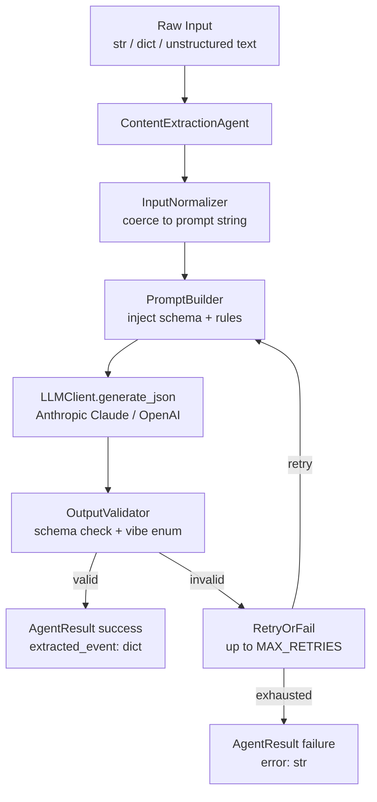
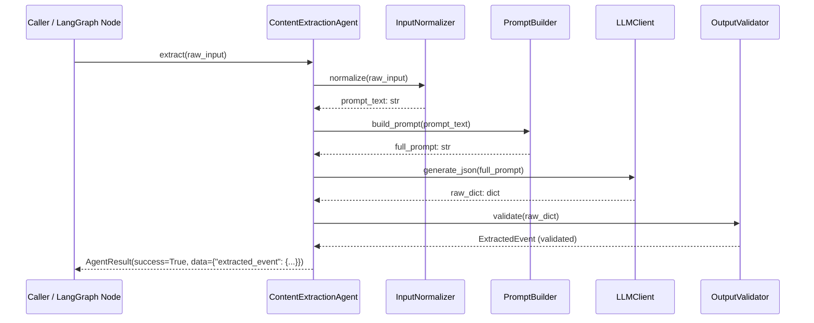
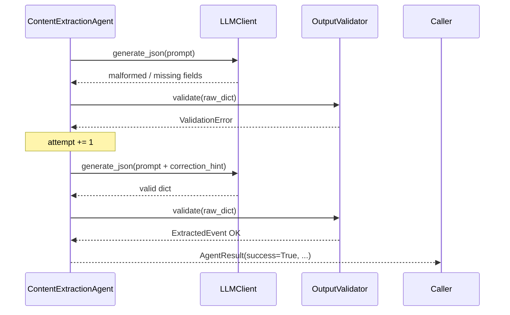

# Design Document: Content Extraction Agent

## Overview

The Content Extraction Agent is a LangGraph-compatible Python agent that accepts structured or unstructured event data (text, dict, or raw string) and uses an LLM to extract key event fields — name, date/time, venue, organizer, audience, and an inferred "vibe" — returning a strict, validated JSON object with no extra text or explanation.

It integrates with the existing `LLMClient` (Anthropic Claude / OpenAI fallback) and follows the `AgentResult` pattern used throughout the WiMLDS pipeline, making it a drop-in node in any LangGraph workflow.

The agent is intentionally narrow in scope: one input, one JSON output, zero prose. It is designed to be the first node in downstream pipelines (poster generation, social posting, etc.) that need a clean, normalized event payload.

---

## Architecture



---

## Sequence Diagrams

### Happy Path



### Retry / Failure Path



---

## Components and Interfaces

### Component 1: `ContentExtractionAgent`

**Purpose**: Orchestrates the full extraction pipeline; public API for callers and LangGraph nodes.

**Interface**:
```python
class ContentExtractionAgent:
    def __init__(self, dry_run: bool = False, max_retries: int = 2) -> None: ...

    def extract(self, raw_input: str | dict) -> AgentResult:
        """
        Extract event fields from raw_input.
        Returns AgentResult with data={"extracted_event": ExtractedEvent}.
        """

    def run(self, state: dict) -> dict:
        """
        LangGraph node interface.
        Reads state["raw_event_input"], writes state["extracted_event"].
        """
```

**Responsibilities**:
- Accept both string and dict inputs
- Coordinate normalizer → prompt builder → LLM → validator pipeline
- Implement retry loop (up to `max_retries`)
- Return `AgentResult` consistent with the rest of the codebase

---

### Component 2: `InputNormalizer`

**Purpose**: Converts any input shape into a clean prompt-ready string.

**Interface**:
```python
class InputNormalizer:
    def normalize(self, raw_input: str | dict) -> str:
        """
        - dict  → JSON-serialized string
        - str   → stripped as-is
        - other → str(raw_input)
        Returns a non-empty string or raises ValueError.
        """
```

**Responsibilities**:
- Handle `dict`, `str`, and edge cases (empty, None)
- Raise `ValueError` for completely empty inputs
- Never truncate — pass full content to the LLM

---

### Component 3: `PromptBuilder`

**Purpose**: Constructs the LLM prompt with the output schema, field rules, and vibe enum baked in.

**Interface**:
```python
class PromptBuilder:
    SYSTEM_PROMPT: str  # class-level constant

    def build(self, event_text: str) -> str:
        """
        Returns the full user prompt string.
        Embeds event_text into the template.
        """
```

**Responsibilities**:
- Embed the exact output JSON schema in the prompt
- Enumerate the valid vibe values
- Instruct the model: no explanation, no markdown fences, pure JSON only
- Keep the system prompt stable (deterministic output)

---

### Component 4: `OutputValidator`

**Purpose**: Validates the LLM's raw dict against the required schema and enum constraints.

**Interface**:
```python
class OutputValidator:
    REQUIRED_KEYS: frozenset[str]
    VALID_VIBES: frozenset[str]

    def validate(self, raw: dict) -> "ExtractedEvent":
        """
        Raises ValidationError if:
        - any required key is missing
        - vibe is not in VALID_VIBES
        - key_highlights is not a list
        Returns a validated ExtractedEvent dataclass.
        """
```

**Responsibilities**:
- Check all six required top-level keys are present
- Validate `vibe` is one of: `formal`, `corporate`, `fun`, `party`, `tech`, `minimal`, `luxury`
- Ensure `key_highlights` is a list (may be empty)
- Coerce string values to stripped strings

---

## Data Models

### `ExtractedEvent`

```python
from dataclasses import dataclass, field

@dataclass
class ExtractedEvent:
    event_name:     str
    date_time:      str
    venue:          str
    organizer:      str
    audience:       str
    vibe:           str        # one of VALID_VIBES
    key_highlights: list[str]  = field(default_factory=list)

    def to_dict(self) -> dict:
        return {
            "event_name":     self.event_name,
            "date_time":      self.date_time,
            "venue":          self.venue,
            "organizer":      self.organizer,
            "audience":       self.audience,
            "vibe":           self.vibe,
            "key_highlights": self.key_highlights,
        }
```

**Validation Rules**:
- `event_name`, `date_time`, `venue`, `organizer`, `audience`, `vibe` — all non-empty strings
- `vibe` ∈ `{"formal", "corporate", "fun", "party", "tech", "minimal", "luxury"}`
- `key_highlights` — list of strings (empty list is valid)

### Output JSON Contract

```json
{
  "event_name":     "string — full event title",
  "date_time":      "string — ISO-like or natural language date/time",
  "venue":          "string — location name and/or address",
  "organizer":      "string — person or organization running the event",
  "audience":       "string — target audience description",
  "vibe":           "formal | corporate | fun | party | tech | minimal | luxury",
  "key_highlights": ["string", "..."]
}
```

---

## Algorithmic Pseudocode

### Main Extraction Algorithm

```pascal
ALGORITHM extract(raw_input)
INPUT:  raw_input of type str | dict
OUTPUT: result of type AgentResult

BEGIN
  ASSERT raw_input IS NOT NULL AND raw_input IS NOT EMPTY

  // Step 1: Normalize input
  event_text ← InputNormalizer.normalize(raw_input)
  ASSERT len(event_text) > 0

  // Step 2: Build prompt
  prompt ← PromptBuilder.build(event_text)

  // Step 3: Retry loop
  attempt ← 0
  WHILE attempt < MAX_RETRIES DO
    ASSERT attempt >= 0 AND attempt < MAX_RETRIES

    TRY
      raw_dict ← LLMClient.generate_json(prompt)
      extracted ← OutputValidator.validate(raw_dict)
      RETURN AgentResult(success=True, data={"extracted_event": extracted.to_dict()})
    CATCH ValidationError AS e
      attempt ← attempt + 1
      IF attempt < MAX_RETRIES THEN
        prompt ← PromptBuilder.build_with_correction(event_text, str(e))
      END IF
    CATCH JSONDecodeError AS e
      attempt ← attempt + 1
    END TRY
  END WHILE

  RETURN AgentResult(success=False, error="Extraction failed after MAX_RETRIES attempts")
END
```

**Preconditions**:
- `raw_input` is a non-null, non-empty string or dict
- `LLMClient` is configured with a valid API key
- `MAX_RETRIES` ≥ 1

**Postconditions**:
- On success: `result.data["extracted_event"]` is a valid dict matching the output schema
- On failure: `result.success = False` and `result.error` is a non-empty string
- No side effects on `raw_input`

**Loop Invariants**:
- `0 ≤ attempt ≤ MAX_RETRIES` throughout the loop
- Each iteration either returns or increments `attempt`

---

### Validation Algorithm

```pascal
ALGORITHM validate(raw_dict)
INPUT:  raw_dict of type dict
OUTPUT: extracted of type ExtractedEvent

BEGIN
  IF raw_dict IS NULL OR NOT isinstance(raw_dict, dict) THEN
    RAISE ValidationError("LLM returned non-dict output")
  END IF

  FOR each key IN REQUIRED_KEYS DO
    IF key NOT IN raw_dict THEN
      RAISE ValidationError("Missing required key: " + key)
    END IF
    IF NOT isinstance(raw_dict[key], (str, list)) THEN
      RAISE ValidationError("Invalid type for key: " + key)
    END IF
  END FOR

  vibe ← raw_dict["vibe"].strip().lower()
  IF vibe NOT IN VALID_VIBES THEN
    RAISE ValidationError("Invalid vibe: " + vibe + ". Must be one of: " + str(VALID_VIBES))
  END IF

  highlights ← raw_dict["key_highlights"]
  IF NOT isinstance(highlights, list) THEN
    highlights ← [str(highlights)]
  END IF

  RETURN ExtractedEvent(
    event_name     = raw_dict["event_name"].strip(),
    date_time      = raw_dict["date_time"].strip(),
    venue          = raw_dict["venue"].strip(),
    organizer      = raw_dict["organizer"].strip(),
    audience       = raw_dict["audience"].strip(),
    vibe           = vibe,
    key_highlights = [str(h).strip() for h IN highlights],
  )
END
```

**Preconditions**:
- `raw_dict` is the direct output of `json.loads()` on the LLM response
- `REQUIRED_KEYS` and `VALID_VIBES` are defined as class-level constants

**Postconditions**:
- Returns a fully populated `ExtractedEvent` with all string fields stripped
- Raises `ValidationError` with a descriptive message on any schema violation

**Loop Invariants**:
- All previously checked keys were present and valid when the loop continues

---

## Key Functions with Formal Specifications

### `ContentExtractionAgent.extract()`

```python
def extract(self, raw_input: str | dict) -> AgentResult: ...
```

**Preconditions**:
- `raw_input` is not `None`
- `raw_input` is either a non-empty `str` or a non-empty `dict`

**Postconditions**:
- Returns `AgentResult` (never raises)
- If `result.success is True`: `result.data["extracted_event"]` contains all 7 keys
- If `result.success is False`: `result.error` is a non-empty descriptive string
- `raw_input` is not mutated

---

### `InputNormalizer.normalize()`

```python
def normalize(self, raw_input: str | dict) -> str: ...
```

**Preconditions**:
- `raw_input` is not `None`

**Postconditions**:
- Returns a non-empty string
- If `raw_input` is a `dict`: result is valid JSON string of that dict
- If `raw_input` is a `str`: result is `raw_input.strip()`
- Raises `ValueError` if result would be empty

---

### `PromptBuilder.build()`

```python
def build(self, event_text: str) -> str: ...
```

**Preconditions**:
- `event_text` is a non-empty string

**Postconditions**:
- Returns a string containing `event_text` embedded in the template
- Output always includes the JSON schema definition
- Output always includes the vibe enum constraint
- Output always includes the "no explanation, pure JSON" instruction

---

### `OutputValidator.validate()`

```python
def validate(self, raw: dict) -> ExtractedEvent: ...
```

**Preconditions**:
- `raw` is the result of `json.loads()` — may be any type

**Postconditions**:
- Returns `ExtractedEvent` if and only if all schema constraints are satisfied
- Raises `ValidationError` with a specific message identifying the first violation
- Does not mutate `raw`

---

## Example Usage

```python
from wimlds.agents.publishing.content_extraction_agent import ContentExtractionAgent

agent = ContentExtractionAgent()

# --- Example 1: Unstructured text input ---
raw_text = """
WiMLDS Pune presents: RAG Systems in Production
Date: 15 Nov 2025, Saturday, 10:00 AM – 1:30 PM IST
Venue: Pune Tech Park, Building C, Level 2, Nagar Road, Pune 411014
Speaker: Aditya Kulkarni, ML Engineer @ Google DeepMind
Open to all ML practitioners and enthusiasts. Hybrid event (80 seats).
"""

result = agent.extract(raw_text)
if result.success:
    print(result.data["extracted_event"])
    # {
    #   "event_name": "RAG Systems in Production",
    #   "date_time": "15 Nov 2025, Saturday, 10:00 AM – 1:30 PM IST",
    #   "venue": "Pune Tech Park, Building C, Level 2, Nagar Road, Pune 411014",
    #   "organizer": "WiMLDS Pune",
    #   "audience": "ML practitioners and enthusiasts",
    #   "vibe": "tech",
    #   "key_highlights": ["RAG Systems in Production", "Hybrid event", "80 seats"]
    # }

# --- Example 2: Structured dict input ---
result = agent.extract({
    "event_title": "WiMLDS Annual Gala",
    "date": "20 Dec 2025",
    "venue_name": "The Ritz, Mumbai",
    "session_type": "Networking Dinner",
})
# vibe → "luxury"

# --- Example 3: LangGraph node usage ---
def node_extract_content(state: dict) -> dict:
    agent = ContentExtractionAgent(dry_run=state.get("dry_run", False))
    result = agent.run(state)   # reads state["raw_event_input"]
    return result               # writes state["extracted_event"]
```

---

## Error Handling

### Error Scenario 1: Empty / None Input

**Condition**: `raw_input` is `None`, `""`, or `{}`
**Response**: `InputNormalizer.normalize()` raises `ValueError`; agent catches it and returns `AgentResult(success=False, error="Empty input")`
**Recovery**: Caller must provide valid input; no retry attempted

### Error Scenario 2: LLM Returns Invalid JSON

**Condition**: LLM response cannot be parsed as JSON (markdown fences, prose, etc.)
**Response**: `LLMClient.generate_json()` raises `json.JSONDecodeError`; agent increments retry counter
**Recovery**: Retry with same prompt up to `MAX_RETRIES`; on exhaustion returns `AgentResult(success=False, error=...)`

### Error Scenario 3: Schema Validation Failure

**Condition**: LLM returns valid JSON but missing required keys or invalid `vibe`
**Response**: `OutputValidator.validate()` raises `ValidationError` with specific message
**Recovery**: Retry with a correction hint appended to the prompt (e.g., "Previous attempt was missing key: vibe")

### Error Scenario 4: LLM API Error

**Condition**: Network failure, rate limit, or invalid API key
**Response**: `LLMClient.generate()` raises an exception; agent catches and returns `AgentResult(success=False, error=str(exc))`
**Recovery**: No retry for API-level errors (caller should handle backoff externally)

---

## Testing Strategy

### Unit Testing Approach

Test each component in isolation with mocked dependencies:
- `InputNormalizer`: test dict→JSON, str→str, empty→ValueError
- `PromptBuilder`: assert schema and vibe enum appear in output
- `OutputValidator`: test all 7 valid vibes, missing keys, wrong types, invalid vibe
- `ContentExtractionAgent.extract()`: mock `LLMClient`, test success path, retry path, exhaustion path

### Property-Based Testing Approach

**Property Test Library**: `hypothesis`

Key properties to test:
- For any non-empty string input, `extract()` returns an `AgentResult` (never raises)
- For any valid `ExtractedEvent` dict, `OutputValidator.validate()` succeeds
- For any dict with a missing required key, `validate()` raises `ValidationError`
- `vibe` in result is always one of the 7 valid values when `success=True`
- `key_highlights` in result is always a list when `success=True`

### Integration Testing Approach

- Test with real `LLMClient` in dry-run mode (returns `[DRY-RUN LLM OUTPUT]`)
- Test the LangGraph node interface: `node_extract_content(state)` reads/writes correct state keys
- Test with the existing `sample_event.json` fixture as dict input

---

## Performance Considerations

- LLM call is the dominant latency (~500ms–2s for Claude Haiku). No caching needed for MVP.
- `max_tokens=512` is sufficient for the fixed-schema output; keep it low to reduce cost and latency.
- The agent is stateless — safe to instantiate per-request or as a singleton.

---

## Security Considerations

- Input text is passed directly to the LLM prompt. Prompt injection is a theoretical risk; mitigated by the strict system prompt that instructs the model to output only JSON.
- API keys are read from `settings` (env-file backed) — never hardcoded.
- No PII is stored; the agent is read-only with respect to external systems.

---

## Dependencies

| Dependency | Purpose | Already in project |
|---|---|---|
| `anthropic` / `openai` | LLM API calls via `LLMClient` | Yes |
| `pydantic-settings` | Settings / env management | Yes |
| `langgraph` | Graph node interface | Yes |
| `hypothesis` | Property-based tests | Add to dev deps |
| `dataclasses` (stdlib) | `ExtractedEvent` model | Yes (stdlib) |

---

## Correctness Properties

*A property is a characteristic or behavior that should hold true across all valid executions of a system — essentially, a formal statement about what the system should do. Properties serve as the bridge between human-readable specifications and machine-verifiable correctness guarantees.*

### Property 1: Input normalization preserves content without truncation

*For any* non-empty string input with arbitrary leading/trailing whitespace, `InputNormalizer.normalize()` shall return a string whose stripped content is identical to the stripped input, with no characters removed from the interior.

**Validates: Requirements 1.1, 1.5**

---

### Property 2: Dict normalization produces valid round-trippable JSON

*For any* non-empty dict, `InputNormalizer.normalize()` shall return a string that is valid JSON and that, when parsed back with `json.loads()`, produces a dict equivalent to the original input.

**Validates: Requirements 1.2**

---

### Property 3: Invalid inputs always raise ValueError

*For any* input that is `None`, an empty string `""`, or an empty dict `{}`, `InputNormalizer.normalize()` shall raise a `ValueError`.

**Validates: Requirements 1.4**

---

### Property 4: Every prompt contains all required structural elements

*For any* non-empty event text, `PromptBuilder.build()` shall return a string that (a) contains the event text verbatim, (b) contains all seven required output field names, (c) contains all seven valid vibe values, and (d) contains an instruction to return pure JSON with no markdown fences or explanation.

**Validates: Requirements 2.1, 2.2, 2.3, 2.4**

---

### Property 5: Prompt construction is deterministic

*For any* event text, calling `PromptBuilder.build()` twice with the same input shall produce identical output strings.

**Validates: Requirements 2.5**

---

### Property 6: Correction prompt contains the error hint

*For any* event text and any validation error message, `PromptBuilder.build_with_correction()` shall return a string that contains both the event text and the error message as a correction hint.

**Validates: Requirements 2.6**

---

### Property 7: Successful extraction always yields all seven fields

*For any* valid LLM response dict that satisfies the output schema, `ContentExtractionAgent.extract()` shall return an `AgentResult` with `success=True` and `data["extracted_event"]` containing exactly the keys `event_name`, `date_time`, `venue`, `organizer`, `audience`, `vibe`, and `key_highlights`.

**Validates: Requirements 3.2, 3.3, 7.2**

---

### Property 8: Valid dicts always pass validation

*For any* dict containing all required keys with a valid vibe value and a list for `key_highlights`, `OutputValidator.validate()` shall return a populated `ExtractedEvent` without raising.

**Validates: Requirements 4.1**

---

### Property 9: Non-dict inputs always fail validation

*For any* value that is not a dict (e.g., string, int, list, None), `OutputValidator.validate()` shall raise a `ValidationError`.

**Validates: Requirements 4.2**

---

### Property 10: Missing required keys always fail validation

*For any* dict that is missing one or more of the required keys, `OutputValidator.validate()` shall raise a `ValidationError` that identifies at least one of the missing keys.

**Validates: Requirements 4.3**

---

### Property 11: Invalid vibe values always fail validation

*For any* dict where the `vibe` field is a string not in `{"formal", "corporate", "fun", "party", "tech", "minimal", "luxury"}`, `OutputValidator.validate()` shall raise a `ValidationError` identifying the invalid vibe.

**Validates: Requirements 4.4**

---

### Property 12: Non-list key_highlights is coerced to a single-element list

*For any* otherwise-valid dict where `key_highlights` is not a list, `OutputValidator.validate()` shall return an `ExtractedEvent` whose `key_highlights` is a list containing exactly one element: the string representation of the original value.

**Validates: Requirements 4.5**

---

### Property 13: String fields are always stripped in validated output

*For any* valid dict whose string fields contain leading or trailing whitespace, `OutputValidator.validate()` shall return an `ExtractedEvent` where all string fields have been stripped of that whitespace.

**Validates: Requirements 4.6**

---

### Property 14: Validation does not mutate the input dict

*For any* dict passed to `OutputValidator.validate()`, the dict shall be identical before and after the call, regardless of whether validation succeeds or raises.

**Validates: Requirements 4.7**

---

### Property 15: Retry count never exceeds MAX_RETRIES

*For any* `max_retries` value ≥ 1, when the LLM consistently returns invalid output, `ContentExtractionAgent.extract()` shall invoke `LLMClient.generate_json()` at most `max_retries` times and then return an `AgentResult` with `success=False` and a non-empty `error` string.

**Validates: Requirements 5.3, 5.4**

---

### Property 16: API-level errors produce failure results without retry

*For any* exception raised by the LLM API (network, rate-limit, authentication), `ContentExtractionAgent.extract()` shall return an `AgentResult` with `success=False` and `error` equal to the exception message, having called `LLMClient.generate_json()` exactly once.

**Validates: Requirements 6.2, 6.5**

---

### Property 17: extract() never raises under any input

*For any* input value (including `None`, empty string, empty dict, arbitrary types), `ContentExtractionAgent.extract()` shall return an `AgentResult` and shall never propagate an exception to the caller.

**Validates: Requirements 6.3, 7.1**

---

### Property 18: Failure results always carry a non-empty error string

*For any* condition that causes `AgentResult.success` to be `False`, the `AgentResult.error` field shall be a non-empty string.

**Validates: Requirements 6.4, 7.3**

---

### Property 19: extract() does not mutate dict inputs

*For any* dict passed as `raw_input` to `ContentExtractionAgent.extract()`, the dict shall be identical before and after the call.

**Validates: Requirements 7.4**

---

### Property 20: run() writes extracted event to state on success

*For any* state dict containing a valid `raw_event_input`, `ContentExtractionAgent.run()` shall return a dict that includes a `extracted_event` key whose value is a dict containing all seven required fields.

**Validates: Requirements 8.3**

---

### Property 21: to_dict() keys exactly match the output JSON contract

*For any* `ExtractedEvent` instance, `to_dict()` shall return a dict whose key set is exactly `{"event_name", "date_time", "venue", "organizer", "audience", "vibe", "key_highlights"}`.

**Validates: Requirements 9.2, 9.4**

---

### Property 22: ExtractedEvent serialization round-trip

*For any* valid `ExtractedEvent`, calling `to_dict()` and then passing the result to `OutputValidator.validate()` shall return an `ExtractedEvent` that is equivalent to the original (all fields equal).

**Validates: Requirements 10.1, 10.2**
