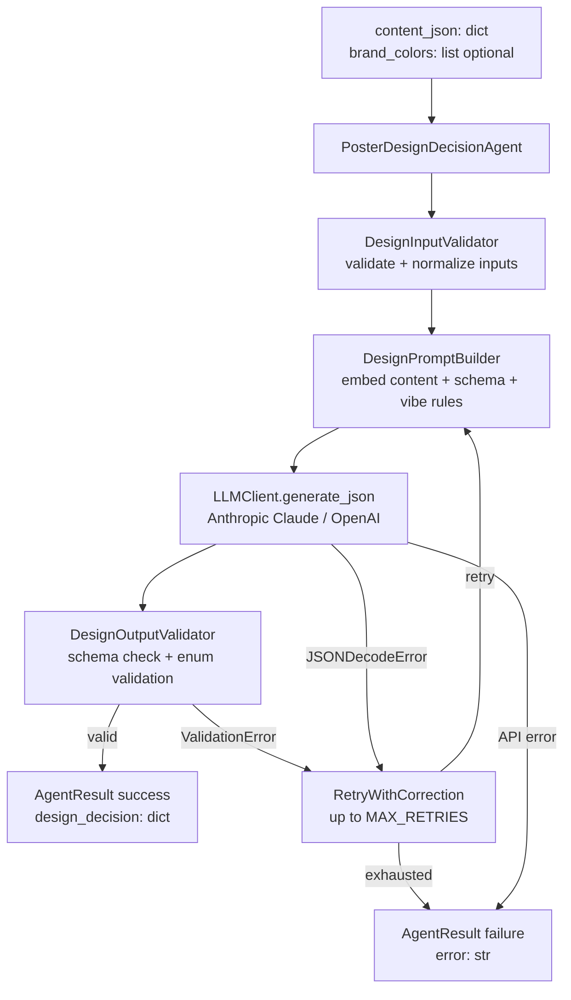
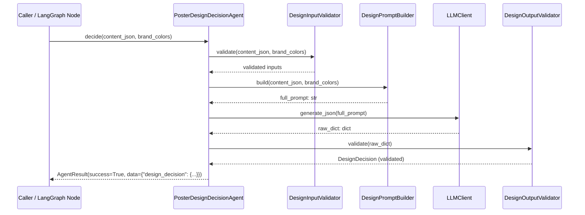
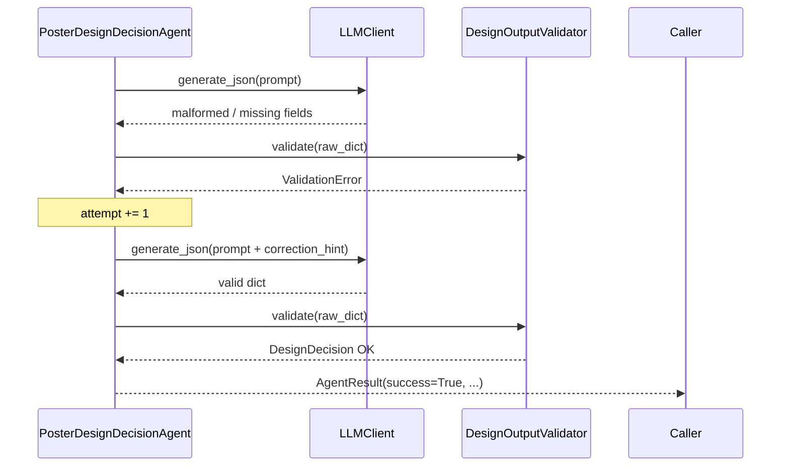

# Design Document: Poster Design Decision Agent

## Overview

The Poster Design Decision Agent is a LangGraph-compatible Python agent that accepts structured event content (as a JSON dict) and optional brand colors, then uses an LLM to make intelligent design decisions for poster generation. It outputs a strict, validated JSON object specifying layout type, color palette, font style, and text hierarchy.

The agent integrates with the existing `LLMClient` (Anthropic Claude / OpenAI fallback), follows the `AgentResult` pattern used throughout the WiMLDS pipeline, and is designed to be called by `PosterAgent` before composing the final poster image. It mirrors the architecture of `ContentExtractionAgent` — one input, one JSON output, zero prose — and is intentionally narrow in scope.

The agent lives at `wimlds/agents/publishing/poster_design_decision_agent.py`.

---

## Architecture



---

## Sequence Diagrams

### Happy Path



### Retry / Failure Path



---

## Components and Interfaces

### Component 1: `PosterDesignDecisionAgent`

**Purpose**: Orchestrates the full design decision pipeline; public API for callers and LangGraph nodes.

**Interface**:
```python
class PosterDesignDecisionAgent:
    def __init__(self, dry_run: bool = False, max_retries: int = 2) -> None: ...

    def decide(
        self,
        content_json: dict,
        brand_colors: list[str] | None = None,
    ) -> AgentResult:
        """
        Make design decisions from event content.
        Returns AgentResult with data={"design_decision": dict} on success.
        Never raises.
        """

    def run(self, state: dict) -> dict:
        """
        LangGraph node interface.
        Reads state["extracted_event"] and state.get("brand_colors").
        Writes state["design_decision"] on success.
        """
```

**Responsibilities**:
- Coordinate validator → prompt builder → LLM → output validator pipeline
- Implement retry loop (up to `max_retries`) with correction hints on `ValidationError`
- Return `AgentResult` consistent with the rest of the codebase
- Never raise exceptions to the caller

---

### Component 2: `DesignInputValidator`

**Purpose**: Validates and normalizes the incoming `content_json` and optional `brand_colors` before they reach the prompt builder.

**Interface**:
```python
class DesignInputValidator:
    def validate(
        self,
        content_json: dict | None,
        brand_colors: list[str] | None,
    ) -> tuple[dict, list[str] | None]:
        """
        Returns (content_json, brand_colors) if valid.
        Raises ValueError with a descriptive message on any violation.
        Does not mutate the inputs.
        """
```

**Responsibilities**:
- Reject `None` or empty `content_json` with `ValueError`
- Accept any non-empty dict as valid `content_json`
- Treat `None` or `[]` brand_colors as absent (return `None`)
- Validate each element of `brand_colors` against `#[0-9A-Fa-f]{3,6}`
- Never mutate the inputs

---

### Component 3: `DesignPromptBuilder`

**Purpose**: Constructs the LLM prompt with the event content, output schema, enum constraints, vibe-matching rules, and brand color instructions baked in.

**Interface**:
```python
class DesignPromptBuilder:
    SYSTEM_PROMPT: str  # class-level constant

    def build(
        self,
        content_json: dict,
        brand_colors: list[str] | None = None,
    ) -> str:
        """
        Returns the full user prompt string.
        Embeds serialized content_json, output schema, enum lists, and vibe rules.
        """

    def build_with_correction(
        self,
        content_json: dict,
        brand_colors: list[str] | None,
        error_message: str,
    ) -> str:
        """
        Returns the full prompt with a correction hint appended.
        """
```

**Responsibilities**:
- Embed the serialized `content_json` in every prompt
- Include the complete output JSON schema in every prompt
- List all valid `layout` values (`minimal`, `bold`, `grid`, `modern`)
- List all valid `font_style` values (`sans-serif`, `serif`, `display`)
- Instruct the model to return pure JSON with no markdown fences or explanation
- Embed brand colors and instruct palette anchoring when provided
- Instruct vibe-derived color selection when brand colors are absent
- Include vibe-to-design mapping rules (see Requirement 11)
- Require exactly three hex color codes in the `colors` array

---

### Component 4: `DesignOutputValidator`

**Purpose**: Validates the LLM's raw dict output against the required schema and enum constraints, returning a `DesignDecision` dataclass.

**Interface**:
```python
class DesignOutputValidator:
    VALID_LAYOUTS: frozenset[str]    # {"minimal", "bold", "grid", "modern"}
    VALID_FONT_STYLES: frozenset[str]  # {"sans-serif", "serif", "display"}
    REQUIRED_KEYS: frozenset[str]    # {"layout", "colors", "font_style", "hierarchy"}

    def validate(self, raw: dict) -> "DesignDecision":
        """
        Raises ValidationError if any schema constraint is violated.
        Returns a populated DesignDecision dataclass.
        Does not mutate the input dict.
        """
```

**Responsibilities**:
- Reject non-dict inputs with `ValidationError`
- Check all four required keys are present
- Normalize `layout` and `font_style` to lowercase before validation
- Validate `layout` against `VALID_LAYOUTS`
- Validate `font_style` against `VALID_FONT_STYLES`
- Validate `colors` is a list of exactly three strings matching `#[0-9A-Fa-f]{3,6}`
- Validate `hierarchy` is a dict with exactly `primary`, `secondary`, `tertiary` keys, each a non-empty string
- Never mutate the input dict

---

## Data Models

### `DesignDecision`

```python
from dataclasses import dataclass

@dataclass
class DesignDecision:
    layout:     str               # one of VALID_LAYOUTS
    colors:     list[str]         # exactly three hex color strings
    font_style: str               # one of VALID_FONT_STYLES
    hierarchy:  dict[str, str]    # exactly {"primary": str, "secondary": str, "tertiary": str}

    def to_dict(self) -> dict:
        return {
            "layout":     self.layout,
            "colors":     self.colors,
            "font_style": self.font_style,
            "hierarchy":  self.hierarchy,
        }
```

**Validation Rules**:
- `layout` ∈ `{"minimal", "bold", "grid", "modern"}`
- `font_style` ∈ `{"sans-serif", "serif", "display"}`
- `colors` — list of exactly 3 strings, each matching `#[0-9A-Fa-f]{3,6}`
- `hierarchy` — dict with exactly keys `primary`, `secondary`, `tertiary`, each a non-empty string

### Output JSON Contract

```json
{
  "layout":     "minimal | bold | grid | modern",
  "colors":     ["#RRGGBB", "#RRGGBB", "#RRGGBB"],
  "font_style": "sans-serif | serif | display",
  "hierarchy": {
    "primary":   "string — main content element (e.g. event title)",
    "secondary": "string — supporting element (e.g. speaker name)",
    "tertiary":  "string — detail element (e.g. date and venue)"
  }
}
```

### `ValidationError`

```python
class ValidationError(Exception):
    """Raised by DesignOutputValidator when LLM output violates schema constraints."""
```

---

## Vibe-to-Design Mapping

The `DesignPromptBuilder` embeds the following mapping rules in every prompt to guide the LLM's design choices:

| Vibe | Preferred Layout | Preferred Font Style |
|---|---|---|
| `tech`, `minimal` | `minimal` or `modern` | `sans-serif` |
| `fun`, `party` | `bold` | `display` |
| `formal`, `corporate` | `grid` or `modern` | `serif` or `sans-serif` |
| `luxury` | `modern` | `serif` |

When `brand_colors` are provided, the LLM is instructed to incorporate them as the dominant palette regardless of vibe.

---

## Algorithmic Pseudocode

### Main Decision Algorithm

```pascal
ALGORITHM decide(content_json, brand_colors)
INPUT:  content_json of type dict, brand_colors of type list[str] | None
OUTPUT: result of type AgentResult

BEGIN
  // Step 1: Validate inputs — raises ValueError on empty/None content_json
  TRY
    (content_json, brand_colors) ← DesignInputValidator.validate(content_json, brand_colors)
  CATCH ValueError AS exc
    RETURN AgentResult(success=False, error=str(exc))
  END TRY

  // Step 2: Build initial prompt
  prompt ← DesignPromptBuilder.build(content_json, brand_colors)

  // Step 3: Retry loop
  attempt ← 0
  WHILE attempt < MAX_RETRIES DO
    TRY
      raw_dict ← LLMClient.generate_json(prompt)
      decision ← DesignOutputValidator.validate(raw_dict)
      RETURN AgentResult(success=True, data={"design_decision": decision.to_dict()})
    CATCH ValidationError AS exc
      attempt ← attempt + 1
      IF attempt < MAX_RETRIES THEN
        prompt ← DesignPromptBuilder.build_with_correction(content_json, brand_colors, str(exc))
      END IF
    CATCH JSONDecodeError AS exc
      attempt ← attempt + 1
    CATCH Exception AS exc
      // API-level error — no retry
      RETURN AgentResult(success=False, error=str(exc))
    END TRY
  END WHILE

  RETURN AgentResult(success=False, error="Design decision failed after MAX_RETRIES attempts")
END
```

**Preconditions**:
- `content_json` is a non-null, non-empty dict
- `LLMClient` is configured with a valid API key
- `MAX_RETRIES` ≥ 1

**Postconditions**:
- On success: `result.data["design_decision"]` is a valid dict with all four fields
- On failure: `result.success = False` and `result.error` is a non-empty string
- No side effects on `content_json` or `brand_colors`

**Loop Invariants**:
- `0 ≤ attempt ≤ MAX_RETRIES` throughout the loop
- Each iteration either returns or increments `attempt`

---

### Output Validation Algorithm

```pascal
ALGORITHM validate(raw)
INPUT:  raw of any type
OUTPUT: decision of type DesignDecision

BEGIN
  IF NOT isinstance(raw, dict) THEN
    RAISE ValidationError("LLM returned non-dict output: " + type(raw))
  END IF

  FOR each key IN {"layout", "colors", "font_style", "hierarchy"} DO
    IF key NOT IN raw THEN
      RAISE ValidationError("Missing required key: " + key)
    END IF
  END FOR

  layout ← raw["layout"].strip().lower()
  IF layout NOT IN {"minimal", "bold", "grid", "modern"} THEN
    RAISE ValidationError("Invalid layout: " + layout)
  END IF

  font_style ← raw["font_style"].strip().lower()
  IF font_style NOT IN {"sans-serif", "serif", "display"} THEN
    RAISE ValidationError("Invalid font_style: " + font_style)
  END IF

  colors ← raw["colors"]
  IF NOT isinstance(colors, list) OR len(colors) != 3 THEN
    RAISE ValidationError("colors must be a list of exactly 3 hex strings")
  END IF
  FOR each c IN colors DO
    IF NOT re.match(r"^#[0-9A-Fa-f]{3,6}$", c) THEN
      RAISE ValidationError("Invalid color: " + c)
    END IF
  END FOR

  hierarchy ← raw["hierarchy"]
  IF NOT isinstance(hierarchy, dict) THEN
    RAISE ValidationError("hierarchy must be a dict")
  END IF
  FOR each key IN {"primary", "secondary", "tertiary"} DO
    IF key NOT IN hierarchy OR NOT isinstance(hierarchy[key], str) OR NOT hierarchy[key].strip() THEN
      RAISE ValidationError("hierarchy." + key + " must be a non-empty string")
    END IF
  END FOR
  IF set(hierarchy.keys()) != {"primary", "secondary", "tertiary"} THEN
    RAISE ValidationError("hierarchy must have exactly keys: primary, secondary, tertiary")
  END IF

  RETURN DesignDecision(
    layout     = layout,
    colors     = colors,
    font_style = font_style,
    hierarchy  = hierarchy,
  )
END
```

---

## Example Usage

```python
from wimlds.agents.publishing.poster_design_decision_agent import PosterDesignDecisionAgent

agent = PosterDesignDecisionAgent()

# --- Example 1: Tech event with brand colors ---
content = {
    "event_name": "RAG Systems in Production",
    "date_time": "15 Nov 2025, 10:00 AM IST",
    "venue": "Pune Tech Park",
    "organizer": "WiMLDS Pune",
    "audience": "ML practitioners",
    "vibe": "tech",
    "key_highlights": ["RAG", "Production ML", "Hybrid event"],
}
result = agent.decide(content, brand_colors=["#4C1D95", "#EC4899", "#7C3AED"])
if result.success:
    dd = result.data["design_decision"]
    # {
    #   "layout": "minimal",
    #   "colors": ["#4C1D95", "#EC4899", "#7C3AED"],
    #   "font_style": "sans-serif",
    #   "hierarchy": {
    #     "primary": "RAG Systems in Production",
    #     "secondary": "WiMLDS Pune — 15 Nov 2025",
    #     "tertiary": "Pune Tech Park · 10:00 AM IST"
    #   }
    # }

# --- Example 2: Luxury event, no brand colors ---
result = agent.decide({"event_name": "Annual Gala", "vibe": "luxury", "venue": "The Ritz"})
# LLM derives a luxury palette; layout="modern", font_style="serif"

# --- Example 3: LangGraph node usage ---
state = {
    "extracted_event": content,
    "brand_colors": ["#4C1D95", "#EC4899", "#7C3AED"],
}
updated_state = agent.run(state)
# updated_state["design_decision"] == dd
```

---

## Error Handling

### Error Scenario 1: Empty / None `content_json`

**Condition**: `content_json` is `None` or `{}`
**Response**: `DesignInputValidator.validate()` raises `ValueError`; agent catches it and returns `AgentResult(success=False, error=...)`
**Recovery**: Caller must provide valid input; no retry attempted

### Error Scenario 2: Invalid `brand_colors` element

**Condition**: One or more elements in `brand_colors` do not match `#[0-9A-Fa-f]{3,6}`
**Response**: `DesignInputValidator.validate()` raises `ValueError` identifying the invalid value
**Recovery**: Caller must fix the color value; no retry attempted

### Error Scenario 3: LLM Returns Invalid JSON

**Condition**: LLM response cannot be parsed as JSON
**Response**: `LLMClient.generate_json()` raises `json.JSONDecodeError`; agent increments retry counter
**Recovery**: Retry with same prompt up to `MAX_RETRIES`; on exhaustion returns `AgentResult(success=False, error=...)`

### Error Scenario 4: Schema Validation Failure

**Condition**: LLM returns valid JSON but missing required keys, invalid enum values, wrong colors format, or malformed hierarchy
**Response**: `DesignOutputValidator.validate()` raises `ValidationError` with specific message
**Recovery**: Retry with a correction hint appended to the prompt

### Error Scenario 5: LLM API Error

**Condition**: Network failure, rate limit, or invalid API key
**Response**: `LLMClient.generate()` raises an exception; agent catches and returns `AgentResult(success=False, error=str(exc))`
**Recovery**: No retry for API-level errors (caller should handle backoff externally)

---

## Testing Strategy

### Unit Testing Approach

Test each component in isolation with mocked dependencies:
- `DesignInputValidator`: test non-empty dict accepted, None/empty dict raises ValueError, valid hex colors accepted, invalid hex raises ValueError, None/[] brand_colors treated as absent, no mutation
- `DesignPromptBuilder`: assert all four output field names appear in prompt, all layout values listed, all font_style values listed, brand colors embedded when provided, vibe rules embedded, correction hint appended by `build_with_correction()`
- `DesignOutputValidator`: test all valid layout/font_style values (including mixed case), missing keys, invalid enums, wrong colors count/format, malformed hierarchy, no mutation
- `PosterDesignDecisionAgent.decide()`: mock `LLMClient`, test success path, retry on `ValidationError`, retry on `JSONDecodeError`, exhaustion path, API error path, dry_run mode

### Property-Based Testing Approach

**Property Test Library**: `hypothesis`

Key properties to test (minimum 100 iterations each):
- For any non-empty dict input, `decide()` returns an `AgentResult` (never raises)
- For any valid `DesignDecision`, `to_dict()` followed by `validate()` returns an equivalent `DesignDecision`
- For any dict missing any required key, `DesignOutputValidator.validate()` raises `ValidationError`
- For any non-dict input, `DesignOutputValidator.validate()` raises `ValidationError`
- For any `max_retries` value, the agent never exceeds that many LLM calls

### Integration Testing Approach

- Test with real `LLMClient` in dry-run mode
- Test the LangGraph node interface: `run(state)` reads/writes correct state keys
- Test with a sample `ExtractedEvent.to_dict()` output as `content_json`


---

## Correctness Properties

*A property is a characteristic or behavior that should hold true across all valid executions of a system — essentially, a formal statement about what the system should do. Properties serve as the bridge between human-readable specifications and machine-verifiable correctness guarantees.*

### Property 1: Non-empty dict inputs are always accepted by DesignInputValidator

*For any* non-empty dict passed as `content_json`, `DesignInputValidator.validate()` shall not raise a `ValueError`.

**Validates: Requirements 1.1**

---

### Property 2: Invalid hex color strings always raise ValueError

*For any* string that does not match the pattern `#[0-9A-Fa-f]{3,6}`, passing it as an element of `brand_colors` to `DesignInputValidator.validate()` shall raise a `ValueError` identifying the invalid value.

**Validates: Requirements 1.5**

---

### Property 3: DesignInputValidator does not mutate its inputs

*For any* non-empty dict `content_json` and any list of strings `brand_colors`, calling `DesignInputValidator.validate()` shall leave both arguments identical to their state before the call, regardless of whether validation succeeds or raises.

**Validates: Requirements 1.6, 7.4**

---

### Property 4: Every prompt contains all required structural elements

*For any* non-empty `content_json` dict, `DesignPromptBuilder.build()` shall return a string that (a) contains the serialized content JSON, (b) contains all four required output field names (`layout`, `colors`, `font_style`, `hierarchy`), (c) contains all four valid layout values (`minimal`, `bold`, `grid`, `modern`), (d) contains all three valid font_style values (`sans-serif`, `serif`, `display`), (e) contains an instruction to return pure JSON with no markdown fences or explanation, and (f) contains a rule requiring exactly three hex color codes.

**Validates: Requirements 2.1, 2.2, 2.3, 2.4, 2.5, 2.8**

---

### Property 5: Brand colors are embedded in the prompt when provided

*For any* non-empty list of valid hex color strings passed as `brand_colors`, `DesignPromptBuilder.build()` shall return a string that contains each of those color strings and instructs the LLM to anchor the palette to those colors.

**Validates: Requirements 2.6, 11.5**

---

### Property 6: Correction prompt always contains the error hint

*For any* `content_json` dict and any non-empty error message string, `DesignPromptBuilder.build_with_correction()` shall return a string that contains the error message as a correction hint.

**Validates: Requirements 2.9**

---

### Property 7: Successful decide() always yields all four design fields

*For any* valid `content_json` dict where the mocked LLM returns a schema-compliant response, `PosterDesignDecisionAgent.decide()` shall return an `AgentResult` with `success=True` and `data["design_decision"]` containing exactly the keys `layout`, `colors`, `font_style`, and `hierarchy`.

**Validates: Requirements 3.2, 3.3, 7.2**

---

### Property 8: Valid dicts always pass output validation

*For any* dict containing all four required keys with valid enum values, a list of exactly three valid hex strings for `colors`, and a `hierarchy` dict with exactly `primary`, `secondary`, `tertiary` non-empty string values, `DesignOutputValidator.validate()` shall return a populated `DesignDecision` without raising.

**Validates: Requirements 4.1**

---

### Property 9: Non-dict inputs always fail output validation

*For any* value that is not a dict (e.g., string, int, list, `None`), `DesignOutputValidator.validate()` shall raise a `ValidationError`.

**Validates: Requirements 4.2**

---

### Property 10: Missing required keys always fail output validation

*For any* dict that is missing one or more of the required keys (`layout`, `colors`, `font_style`, `hierarchy`), `DesignOutputValidator.validate()` shall raise a `ValidationError` identifying at least one of the missing keys.

**Validates: Requirements 4.3**

---

### Property 11: Invalid field values always fail output validation

*For any* dict where `layout` is not in `{"minimal", "bold", "grid", "modern"}`, or `font_style` is not in `{"sans-serif", "serif", "display"}`, or `colors` is not a list of exactly three strings each matching `#[0-9A-Fa-f]{3,6}`, or `hierarchy` is missing any of `primary`/`secondary`/`tertiary` or has empty string values, `DesignOutputValidator.validate()` shall raise a `ValidationError` describing the violation.

**Validates: Requirements 4.4, 4.5, 4.6, 4.7**

---

### Property 12: Layout and font_style are normalized to lowercase before validation

*For any* dict where `layout` or `font_style` is a valid value expressed in uppercase or mixed case (e.g., `"MINIMAL"`, `"Sans-Serif"`), `DesignOutputValidator.validate()` shall succeed and return a `DesignDecision` with the lowercase-normalized value.

**Validates: Requirements 4.8**

---

### Property 13: DesignOutputValidator does not mutate its input

*For any* dict passed to `DesignOutputValidator.validate()`, the dict shall be identical before and after the call, regardless of whether validation succeeds or raises.

**Validates: Requirements 4.9**

---

### Property 14: Retry count never exceeds MAX_RETRIES

*For any* `max_retries` value ≥ 1, when the LLM consistently returns invalid output (always raising `ValidationError` or `JSONDecodeError`), `PosterDesignDecisionAgent.decide()` shall invoke `LLMClient.generate_json()` at most `max_retries` times and then return an `AgentResult` with `success=False` and a non-empty `error` string.

**Validates: Requirements 5.3, 5.4**

---

### Property 15: decide() never raises under any input

*For any* input value (including `None`, empty dict, arbitrary types, invalid brand colors), `PosterDesignDecisionAgent.decide()` shall return an `AgentResult` and shall never propagate an exception to the caller.

**Validates: Requirements 6.1, 6.3, 7.1**

---

### Property 16: API-level errors produce failure results without retry

*For any* exception raised by the LLM API (network, rate-limit, authentication), `PosterDesignDecisionAgent.decide()` shall return an `AgentResult` with `success=False` and `error` equal to the exception message, having called `LLMClient.generate_json()` exactly once.

**Validates: Requirements 6.2, 6.5**

---

### Property 17: Failure results always carry a non-empty error string

*For any* condition that causes `AgentResult.success` to be `False`, the `AgentResult.error` field shall be a non-empty string.

**Validates: Requirements 6.4, 7.3**

---

### Property 18: to_dict() keys exactly match the output JSON contract

*For any* `DesignDecision` instance, `to_dict()` shall return a dict whose key set is exactly `{"layout", "colors", "font_style", "hierarchy"}`.

**Validates: Requirements 9.2, 9.3**

---

### Property 19: DesignDecision serialization round-trip

*For any* valid `DesignDecision` instance, calling `to_dict()` and then passing the result to `DesignOutputValidator.validate()` shall return a `DesignDecision` that is equivalent to the original (all fields equal).

**Validates: Requirements 10.1, 10.2**

---

### Property 20: Vibe-to-design mapping rules are embedded in every prompt

*For any* `content_json` containing a `vibe` field, `DesignPromptBuilder.build()` shall return a prompt that contains layout and font style guidance corresponding to that vibe value — specifically: `tech`/`minimal` → `minimal`/`modern` + `sans-serif`; `fun`/`party` → `bold` + `display`; `formal`/`corporate` → `grid`/`modern` + `serif`/`sans-serif`; `luxury` → `modern` + `serif`.

**Validates: Requirements 11.1, 11.2, 11.3, 11.4**

---

### Property 21: run() writes design_decision to state on success

*For any* state dict containing a valid `extracted_event` key, when the mocked LLM returns a schema-compliant response, `PosterDesignDecisionAgent.run()` shall return a dict that includes a `design_decision` key whose value is a dict containing all four required fields.

**Validates: Requirements 8.2, 8.3**
