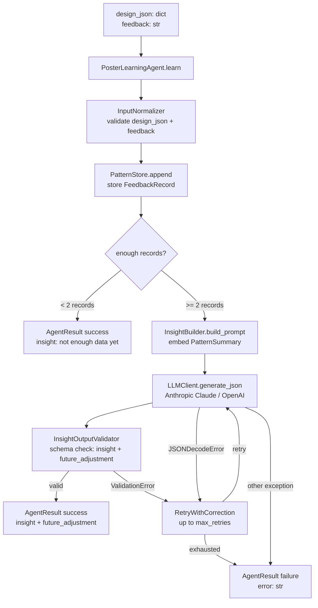
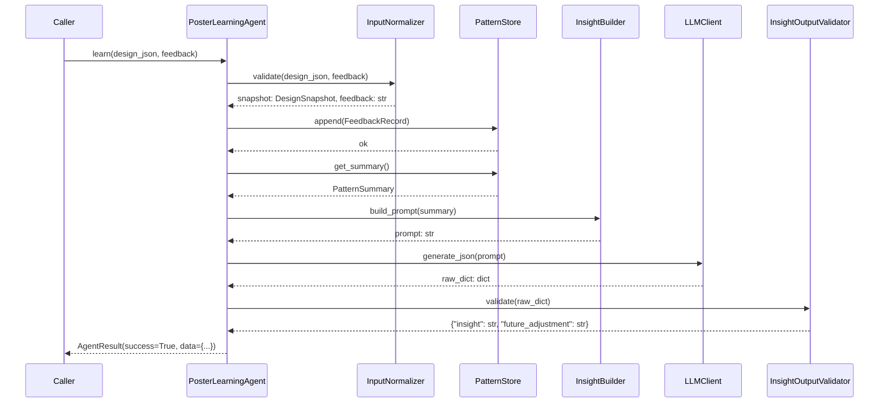
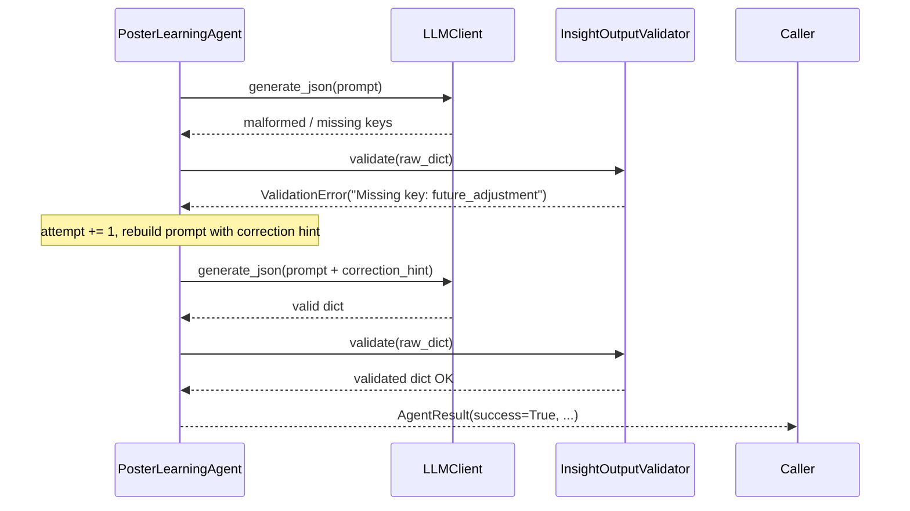

# Design Document: Poster Learning Agent

## Overview

The Poster Learning Agent is a LangGraph-compatible Python agent that observes poster design
outcomes over time and builds a simple pattern memory. It accepts a poster design JSON and a user
feedback signal (`approved` / `rejected`), stores what worked and what did not in a `PatternStore`,
and produces a plain-language insight plus a future adjustment recommendation via an LLM call.

The agent follows the same `InputNormalizer → PromptBuilder → LLMClient → OutputValidator →
AgentResult` architecture used by `BrandIntelligenceAgent`, making it a drop-in node in any
LangGraph workflow. It lives at `wimlds/agents/publishing/poster_learning_agent.py`.

---

## Architecture



---

## Sequence Diagrams

### Happy Path



### Retry / Failure Path



---

## Components and Interfaces

### Component 1: `PosterLearningAgent`

**Purpose**: Orchestrates the full learning pipeline; public API for callers and LangGraph nodes.

**Interface**:
```python
class PosterLearningAgent:
    def __init__(self, dry_run: bool = False, max_retries: int = 2,
                 store_path: Optional[str] = None) -> None: ...

    def learn(self, design_json: dict, feedback: str) -> AgentResult:
        """
        Record the design outcome and produce an insight.
        Returns AgentResult with data={"insight": str, "future_adjustment": str} on success.
        Never raises.
        """

    def run(self, state: dict) -> dict:
        """
        LangGraph node interface.
        Reads state["design_json"] and state["feedback"].
        Writes state["learning_insight"] on success.
        Returns updated state dict in all cases.
        """
```

**Responsibilities**:
- Validate inputs via `InputNormalizer`
- Delegate storage to `PatternStore`
- Delegate prompt construction to `InsightBuilder`
- Coordinate the LLM call and retry loop
- Return `AgentResult` — never raise to the caller

---

### Component 2: `InputNormalizer`

**Purpose**: Validates and normalises `design_json` and `feedback` before any processing.

**Interface**:
```python
class InputNormalizer:
    def normalize(self, design_json: dict, feedback: str) -> tuple[dict, str]:
        """
        Validates design_json (non-None, non-empty, has 'layout' and 'colors').
        Normalises feedback to lowercase and validates it is 'approved' or 'rejected'.
        Returns (design_json, normalised_feedback).
        Raises ValueError with a descriptive message on any violation.
        Does not mutate the inputs.
        """
```

---

### Component 3: `PatternStore`

**Purpose**: Persists `FeedbackRecord` entries in memory (and optionally to a JSON file) and
exposes a `get_summary()` method for pattern counts.

**Interface**:
```python
class PatternStore:
    def __init__(self, file_path: Optional[str] = None) -> None: ...

    def append(self, record: FeedbackRecord) -> None:
        """Append a record to the in-memory store and persist if file_path is set."""

    def get_summary(self) -> dict:
        """
        Return a PatternSummary dict:
        {
          "total": int,
          "by_layout": {layout: {"approved": int, "rejected": int}, ...},
          "by_colors": {colors_key: {"approved": int, "rejected": int}, ...}
        }
        """

    def __len__(self) -> int:
        """Return the number of stored records."""
```

---

### Component 4: `InsightBuilder`

**Purpose**: Constructs the LLM prompt from a `PatternSummary` and provides a correction variant.

**Interface**:
```python
class InsightBuilder:
    SYSTEM_PROMPT: str  # class-level constant

    def build_prompt(self, summary: dict) -> str:
        """
        Embed the PatternSummary in a prompt asking for insight + future_adjustment.
        Instructs the LLM to use plain language, no ML jargon, pure JSON only.
        """

    def build_with_correction(self, summary: dict, error_message: str) -> str:
        """
        Returns the base prompt with the previous error appended as a correction hint.
        """
```

---

### Component 5: `InsightOutputValidator`

**Purpose**: Validates the LLM's raw dict against `{"insight": str, "future_adjustment": str}`.

**Interface**:
```python
class InsightOutputValidator:
    REQUIRED_KEYS: frozenset[str]  # {"insight", "future_adjustment"}

    def validate(self, raw: dict) -> dict:
        """
        Raises ValidationError if any schema constraint is violated.
        Returns the validated dict unchanged on success.
        Does not mutate the input dict.
        """
```

---

## Data Models

### `FeedbackRecord`

```python
from dataclasses import dataclass
from datetime import datetime

@dataclass
class FeedbackRecord:
    design_snapshot: dict   # {"layout": str, "colors": any}
    feedback: str           # "approved" or "rejected"
    timestamp: str          # ISO-8601 string

    def to_dict(self) -> dict:
        return {
            "design_snapshot": self.design_snapshot,
            "feedback":        self.feedback,
            "timestamp":       self.timestamp,
        }

    @classmethod
    def from_dict(cls, d: dict) -> "FeedbackRecord":
        return cls(
            design_snapshot=d["design_snapshot"],
            feedback=d["feedback"],
            timestamp=d["timestamp"],
        )
```

**Validation Rules**:
- `design_snapshot` — dict with at least `layout` and `colors` keys
- `feedback` — exactly `"approved"` or `"rejected"` (lowercase)
- `timestamp` — ISO-8601 string (e.g. `datetime.utcnow().isoformat()`)

### `PatternSummary` (dict shape)

```json
{
  "total": 5,
  "by_layout": {
    "centered": {"approved": 3, "rejected": 1},
    "split":    {"approved": 0, "rejected": 1}
  },
  "by_colors": {
    "#1A2B4C,#C9A84C": {"approved": 2, "rejected": 0}
  }
}
```

### Output JSON Contract

```json
{
  "insight":            "Centered layouts are approved 75% of the time.",
  "future_adjustment":  "Prefer centered layouts and the navy/gold color pair."
}
```

### `AgentResult` (existing)

```python
@dataclass
class AgentResult:
    success: bool
    data:    dict = field(default_factory=dict)
    error:   Optional[str] = None
```

On success: `data = {"insight": "...", "future_adjustment": "..."}`

---

## Algorithmic Pseudocode

### Main Learning Algorithm

```pascal
ALGORITHM learn(design_json, feedback)
INPUT:  design_json: dict, feedback: str
OUTPUT: result: AgentResult

BEGIN
  // Step 1: Validate and normalise inputs
  TRY
    snapshot, norm_feedback ← InputNormalizer.normalize(design_json, feedback)
  CATCH ValueError AS e
    RETURN AgentResult(success=False, error=str(e))
  END TRY

  // Step 2: Store the record
  record ← FeedbackRecord(
    design_snapshot = {"layout": snapshot["layout"], "colors": snapshot["colors"]},
    feedback        = norm_feedback,
    timestamp       = datetime.utcnow().isoformat()
  )
  PatternStore.append(record)

  // Step 3: Early-exit if not enough data
  IF len(PatternStore) < 2 THEN
    RETURN AgentResult(
      success=True,
      data={"insight": "Not enough data yet — keep submitting feedback.",
            "future_adjustment": ""}
    )
  END IF

  // Step 4: Build prompt from pattern summary
  summary ← PatternStore.get_summary()
  prompt  ← InsightBuilder.build_prompt(summary)

  // Step 5: Retry loop
  attempt ← 0
  WHILE attempt < max_retries DO
    TRY
      raw_dict   ← LLMClient.generate_json(prompt)
      validated  ← InsightOutputValidator.validate(raw_dict)
      RETURN AgentResult(success=True, data=validated)
    CATCH ValidationError AS e
      attempt ← attempt + 1
      IF attempt < max_retries THEN
        prompt ← InsightBuilder.build_with_correction(summary, str(e))
      END IF
    CATCH JSONDecodeError
      attempt ← attempt + 1
    CATCH Exception AS e
      RETURN AgentResult(success=False, error=str(e))
    END TRY
  END WHILE

  RETURN AgentResult(success=False, error="Insight generation failed after max_retries attempts")
END
```

### Validation Algorithm

```pascal
ALGORITHM InputNormalizer.normalize(design_json, feedback)
BEGIN
  IF design_json IS None OR design_json == {} THEN
    RAISE ValueError("design_json must be a non-empty dict")
  END IF
  IF "layout" NOT IN design_json THEN
    RAISE ValueError("design_json is missing required key: layout")
  END IF
  IF "colors" NOT IN design_json THEN
    RAISE ValueError("design_json is missing required key: colors")
  END IF
  norm_feedback ← feedback.strip().lower()
  IF norm_feedback NOT IN {"approved", "rejected"} THEN
    RAISE ValueError("feedback must be 'approved' or 'rejected', got: " + feedback)
  END IF
  RETURN design_json, norm_feedback
END
```

---

## Example Usage

```python
from wimlds.agents.publishing.poster_learning_agent import PosterLearningAgent

agent = PosterLearningAgent()

# First call — not enough data yet
result = agent.learn(
    design_json={"layout": "centered", "colors": ["#1A2B4C", "#C9A84C"], "title": "WiMLDS"},
    feedback="approved",
)
# result.success == True
# result.data["insight"] == "Not enough data yet — keep submitting feedback."

# Second call — LLM insight generated
result = agent.learn(
    design_json={"layout": "split", "colors": ["#FF0000", "#FFFFFF"], "title": "Event"},
    feedback="rejected",
)
# result.success == True
# result.data == {"insight": "...", "future_adjustment": "..."}

# LangGraph node usage
state = {"design_json": {...}, "feedback": "Approved"}
updated = agent.run(state)
# updated["learning_insight"] == {"insight": "...", "future_adjustment": "..."}

# Dry-run
agent_dry = PosterLearningAgent(dry_run=True)
result = agent_dry.learn({"layout": "centered", "colors": []}, "approved")
# result.data == {"insight": "dry-run", "future_adjustment": "dry-run"}

# File-backed store
agent_persistent = PosterLearningAgent(store_path="/tmp/patterns.json")
```

---

## Error Handling

### Error Scenario 1: Invalid `design_json`

**Condition**: `design_json` is `None`, `{}`, or missing `layout` / `colors`
**Response**: `InputNormalizer.normalize()` raises `ValueError`; agent returns
`AgentResult(success=False, error=<descriptive message>)`
**Recovery**: Caller must provide valid input; no retry attempted

### Error Scenario 2: Invalid `feedback`

**Condition**: `feedback` is not `"approved"` or `"rejected"` after case normalisation
**Response**: `InputNormalizer.normalize()` raises `ValueError`; agent returns failure result
**Recovery**: Caller must provide a valid feedback string

### Error Scenario 3: LLM Returns Invalid JSON

**Condition**: LLM response cannot be parsed as JSON
**Response**: `json.JSONDecodeError` increments retry counter
**Recovery**: Retry with same base prompt up to `max_retries`

### Error Scenario 4: Schema Validation Failure

**Condition**: LLM returns valid JSON but missing `insight` or `future_adjustment`, or empty values
**Response**: `InsightOutputValidator.validate()` raises `ValidationError`
**Recovery**: Retry with correction hint appended to the prompt

### Error Scenario 5: LLM API Error

**Condition**: Network failure, rate limit, authentication error
**Response**: Agent catches the exception and returns `AgentResult(success=False, error=str(exc))`
**Recovery**: No retry for API-level errors

### Error Scenario 6: Retry Exhaustion

**Condition**: All `max_retries` attempts fail
**Response**: Returns `AgentResult(success=False, error="Insight generation failed after N attempts")`

---

## Testing Strategy

### Unit Testing Approach

Test each component in isolation with mocked dependencies:

- `InputNormalizer`: valid dict+feedback → returns tuple; None/empty dict → ValueError; missing
  layout/colors → ValueError; invalid feedback → ValueError; no mutation
- `PatternStore`: append grows store; get_summary counts correctly; file load/save round-trip;
  records not lost on append
- `InsightBuilder`: summary embedded in prompt; both keys in schema instruction; correction hint
  appended; pure-JSON instruction present
- `InsightOutputValidator`: valid dict → returned unchanged; non-dict → ValidationError; missing
  keys → ValidationError; empty strings → ValidationError; no mutation
- `PosterLearningAgent.learn()`: mock LLM for success, retry (ValidationError), retry
  (JSONDecodeError), exhaustion, API exception, dry_run, < 2 records early-exit
- `PosterLearningAgent.run()`: state read/write on success; no write on failure

### Property-Based Testing Approach

**Property Test Library**: `hypothesis`

Each property test runs a minimum of 100 iterations. Tests are tagged with:
`# Feature: poster-learning-agent, Property N: <property_text>`

### Integration Testing Approach

- Test with `LLMClient(dry_run=True)` to verify pipeline wiring without API calls
- Test the LangGraph node interface: `agent.run(state)` reads/writes correct state keys
- Test file-backed `PatternStore` round-trip with a temporary file


---

## Correctness Properties

*A property is a characteristic or behavior that should hold true across all valid executions of a
system — essentially, a formal statement about what the system should do. Properties serve as the
bridge between human-readable specifications and machine-verifiable correctness guarantees.*

### Property 1: Valid inputs are accepted without error

*For any* non-empty dict containing at least `layout` and `colors` keys, and any case-variant of
`"approved"` or `"rejected"` as feedback, `InputNormalizer.normalize()` shall return without raising
and shall return the feedback normalised to lowercase.

**Validates: Requirements 1.1, 1.2**

---

### Property 2: Invalid feedback strings are always rejected

*For any* string that is not a case-variant of `"approved"` or `"rejected"`,
`InputNormalizer.normalize()` shall raise a `ValueError`.

**Validates: Requirements 1.6**

---

### Property 3: learn() never mutates its inputs

*For any* `design_json` dict and `feedback` string passed to `PosterLearningAgent.learn()`, both
values shall be identical before and after the call, regardless of whether the call succeeds or
fails.

**Validates: Requirements 1.7, 7.4**

---

### Property 4: Each valid learn() call grows the store by exactly one record with correct fields

*For any* valid `design_json` (containing `layout` and `colors`) and valid `feedback`, calling
`PosterLearningAgent.learn()` shall increase `len(PatternStore)` by exactly 1, and the appended
record's `design_snapshot` shall contain the same `layout` and `colors` values as the input, with
`feedback` normalised to lowercase.

**Validates: Requirements 2.1, 2.2, 2.3, 2.4**

---

### Property 5: PatternStore records are never lost on append

*For any* sequence of N valid `FeedbackRecord` appends, `len(PatternStore)` shall equal N after all
appends complete.

**Validates: Requirements 2.7**

---

### Property 6: get_summary() counts correctly by layout and colors

*For any* set of `FeedbackRecord` entries in the store, `PatternStore.get_summary()` shall return a
`PatternSummary` where the approved and rejected counts in `by_layout` and `by_colors` exactly match
the counts computed by iterating over the stored records directly.

**Validates: Requirements 2.5, 2.6**

---

### Property 7: PatternStore file round-trip preserves all records

*For any* sequence of `FeedbackRecord` entries written to a file-backed `PatternStore`, constructing
a new `PatternStore` from the same file path shall produce a store with the same number of records
and equivalent record contents.

**Validates: Requirements 2.8, 2.9**

---

### Property 8: Every InsightBuilder prompt contains all required structural elements

*For any* `PatternSummary` dict, `InsightBuilder.build_prompt()` shall return a string that (a)
contains a JSON-serialised representation of the summary, (b) contains both key names `insight` and
`future_adjustment`, and (c) contains an instruction to return pure JSON with no markdown fences.

**Validates: Requirements 3.2, 3.3, 3.5**

---

### Property 9: Correction prompt contains both summary and error hint

*For any* `PatternSummary` and any error message string, `InsightBuilder.build_with_correction()`
shall return a string that contains both the summary content and the error message.

**Validates: Requirements 5.1**

---

### Property 10: Valid dicts are returned unchanged by InsightOutputValidator

*For any* dict containing `insight` and `future_adjustment` as non-empty strings,
`InsightOutputValidator.validate()` shall return a dict equal to the input without raising.

**Validates: Requirements 4.1**

---

### Property 11: Non-dict inputs always fail InsightOutputValidator

*For any* value that is not a dict (string, int, list, None, etc.),
`InsightOutputValidator.validate()` shall raise a `ValidationError`.

**Validates: Requirements 4.2**

---

### Property 12: validate() never mutates its input dict

*For any* dict passed to `InsightOutputValidator.validate()`, the dict shall be identical before and
after the call, regardless of whether validation succeeds or raises.

**Validates: Requirements 4.7**

---

### Property 13: Retry count never exceeds max_retries

*For any* `max_retries` value ≥ 1, when the LLM consistently returns invalid output (either
`ValidationError` or `JSONDecodeError`), `PosterLearningAgent.learn()` shall invoke
`LLMClient.generate_json()` at most `max_retries` times and then return an `AgentResult` with
`success=False` and a non-empty `error` string.

**Validates: Requirements 5.2, 5.3, 5.4**

---

### Property 14: learn() never raises under any input

*For any* input value (including `None`, empty dict, arbitrary types, invalid feedback),
`PosterLearningAgent.learn()` shall return an `AgentResult` and shall never propagate an exception
to the caller.

**Validates: Requirements 6.1, 7.1**

---

### Property 15: Failure results always carry a non-empty error string

*For any* condition that causes `PosterLearningAgent.learn()` to return `success=False`, the
returned `AgentResult.error` shall be a non-empty, human-readable string.

**Validates: Requirements 6.4, 7.3**

---

### Property 16: run() writes learning_insight to state on success

*For any* state dict containing a valid `design_json` and `feedback`, `PosterLearningAgent.run()`
shall return a dict that includes a `learning_insight` key whose value is a dict containing exactly
`insight` and `future_adjustment`.

**Validates: Requirements 8.3**

---

### Property 17: run() does not write learning_insight to state on failure

*For any* state dict where learning fails (invalid input, LLM error, retry exhaustion),
`PosterLearningAgent.run()` shall return a state dict that does not contain a `learning_insight` key
that was not already present before the call.

**Validates: Requirements 8.4**

---

### Property 18: FeedbackRecord serialization round-trip

*For any* valid `FeedbackRecord` instance, calling `to_dict()` and then `FeedbackRecord.from_dict()`
on the result shall produce a record with identical `design_snapshot`, `feedback`, and `timestamp`
fields.

**Validates: Requirements 9.1, 9.3**

---

### Property 19: FeedbackRecord.to_dict() key set is exactly the output contract

*For any* `FeedbackRecord` instance, `to_dict()` shall return a dict whose key set is exactly
`{"design_snapshot", "feedback", "timestamp"}`.

**Validates: Requirements 9.2**
