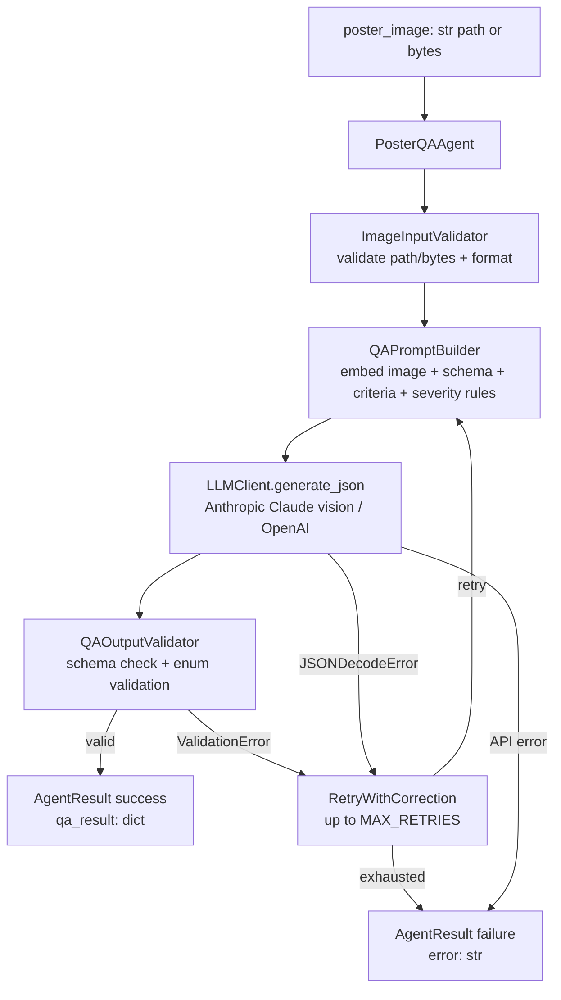
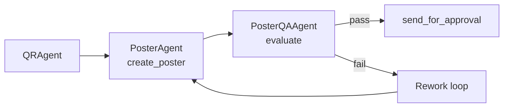
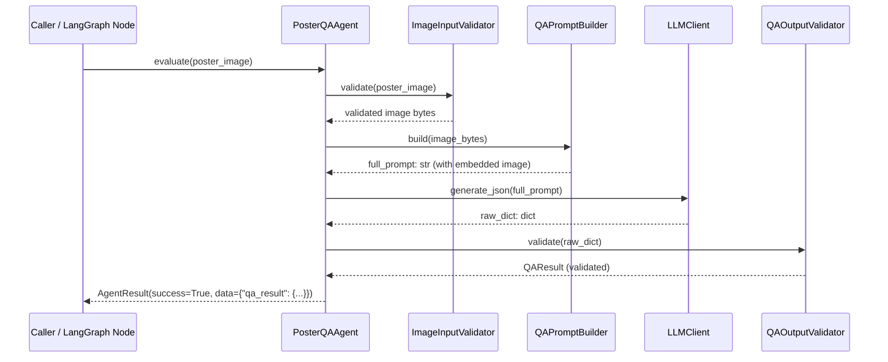
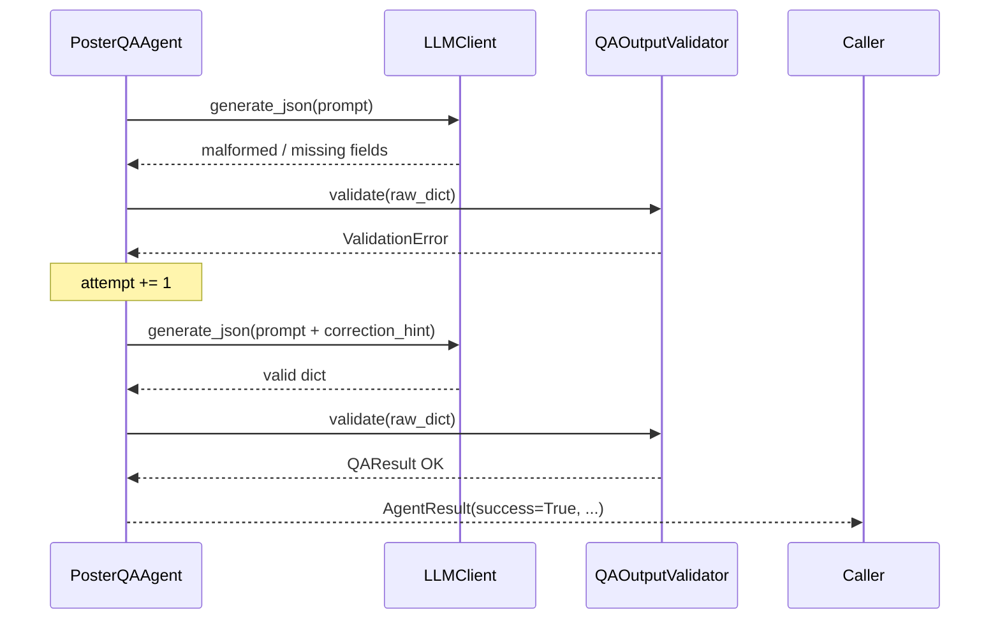

# Design Document: Poster QA Agent

## Overview

The Poster QA Agent is a LangGraph-compatible Python agent that performs automated visual quality assurance on generated event poster images. It accepts a poster image (as a file path or binary bytes) and uses an LLM with vision capabilities to evaluate text readability, element alignment, color contrast, and information completeness. The agent outputs a strict JSON object containing a list of flagged issues (each with `type`, `description`, and `severity`) and a pass/fail verdict.

The agent integrates with the existing `LLMClient` (Anthropic Claude / OpenAI fallback), follows the `AgentResult` pattern used throughout the WiMLDS pipeline, and is designed to run after `PosterAgent.create_poster()` and before the approval email is sent. It mirrors the architecture of `ContentExtractionAgent` and `PosterDesignDecisionAgent` — one input, one JSON output, zero prose — and lives at `wimlds/agents/publishing/poster_qa_agent.py`.

---

## Architecture



### Pipeline Position



The `PosterQAAgent` slots between `node_create_poster` and `node_approve_poster` in the LangGraph orchestrator. It reads `state["_poster_local_path"]` (written by `PosterAgent`) and writes `state["qa_result"]`.

---

## Sequence Diagrams

### Happy Path



### Retry / Failure Path



---

## Components and Interfaces

### Component 1: `PosterQAAgent`

**Purpose**: Orchestrates the full QA pipeline; public API for callers and LangGraph nodes.

**Interface**:
```python
class PosterQAAgent:
    def __init__(self, dry_run: bool = False, max_retries: int = 2) -> None: ...

    def evaluate(self, poster_image: str | bytes) -> AgentResult:
        """
        Evaluate a poster image for visual quality issues.
        Returns AgentResult with data={"qa_result": {"issues": [...], "verdict": "pass"|"fail"}}.
        Never raises.
        """

    def run(self, state: dict) -> dict:
        """
        LangGraph node interface.
        Reads state["_poster_local_path"], writes state["qa_result"] on success.
        """
```

**Responsibilities**:
- Coordinate validator → prompt builder → LLM → output validator pipeline
- Implement retry loop (up to `max_retries`) with correction hints on `ValidationError`
- Return `AgentResult` consistent with the rest of the codebase
- Never raise exceptions to the caller
- In `dry_run` mode: return a deterministic stub result without calling the LLM

---

### Component 2: `ImageInputValidator`

**Purpose**: Validates the incoming poster image input (file path or bytes) before it reaches the prompt builder.

**Interface**:
```python
class ImageInputValidator:
    ALLOWED_EXTENSIONS: frozenset[str]  # {".png", ".jpg", ".jpeg"}

    def validate(self, poster_image: str | bytes | None) -> bytes:
        """
        Returns image bytes if valid.
        Raises ValueError with a descriptive message on any violation.
        Does not mutate the poster_image argument.
        """
```

**Responsibilities**:
- Reject `None` or empty string with `ValueError`
- For string inputs: check file exists, check extension is `.png`/`.jpg`/`.jpeg` (case-insensitive), read and return bytes
- For bytes inputs: accept any non-empty bytes as-is
- Never mutate the input argument

---

### Component 3: `QAPromptBuilder`

**Purpose**: Constructs the LLM vision prompt embedding the poster image, evaluation criteria, output schema, severity rules, and verdict determination logic.

**Interface**:
```python
class QAPromptBuilder:
    SYSTEM_PROMPT: str  # class-level constant

    def build(self, image_bytes: bytes) -> str:
        """
        Returns the full prompt string with the image embedded as base64.
        Includes schema, enum lists, evaluation criteria, and verdict rules.
        """

    def build_with_correction(self, image_bytes: bytes, error_message: str) -> str:
        """
        Returns the full prompt with a correction hint appended.
        """
```

**Responsibilities**:
- Encode image bytes as base64 and embed in the prompt for vision analysis
- Include the complete output JSON schema in every prompt
- List all valid `type` values: `text_readability`, `alignment`, `color_contrast`, `missing_information`, `unclear_information`
- List all valid `severity` values: `low`, `medium`, `high`
- List all valid `verdict` values: `pass`, `fail`
- Include explicit verdict determination rules: `fail` if any `high` or `medium` severity issue; `pass` only if all issues are `low` or list is empty
- Include evaluation criteria covering all four quality dimensions
- Instruct the LLM to be critical and only flag real, observable issues
- Instruct the model to return pure JSON with no markdown fences or explanation
- Append correction hint in `build_with_correction()`

---

### Component 4: `QAOutputValidator`

**Purpose**: Validates the LLM's raw dict output against the required schema and enum constraints, returning a `QAResult` dataclass.

**Interface**:
```python
class QAOutputValidator:
    VALID_ISSUE_TYPES: frozenset[str]
    VALID_SEVERITIES: frozenset[str]
    VALID_VERDICTS: frozenset[str]
    REQUIRED_ISSUE_KEYS: frozenset[str]

    def validate(self, raw) -> "QAResult":
        """
        Raises ValidationError if any schema constraint is violated.
        Returns a populated QAResult dataclass.
        Does not mutate the input dict.
        """
```

**Responsibilities**:
- Reject non-dict inputs with `ValidationError`
- Check both required top-level keys (`issues`, `verdict`) are present
- Normalize `verdict`, `type`, and `severity` values to lowercase before validation
- Validate `verdict` is one of `{"pass", "fail"}`
- Validate `issues` is a list
- Validate each issue element is a dict with `type`, `description`, `severity` keys
- Validate each issue's `type` is one of the five valid types
- Validate each issue's `severity` is one of `{"low", "medium", "high"}`
- Never mutate the input dict

---

## Data Models

### `QAIssue`

```python
from dataclasses import dataclass

@dataclass
class QAIssue:
    type:        str   # one of VALID_ISSUE_TYPES
    description: str   # human-readable description of the issue
    severity:    str   # one of {"low", "medium", "high"}

    def to_dict(self) -> dict:
        return {
            "type":        self.type,
            "description": self.description,
            "severity":    self.severity,
        }
```

### `QAResult`

```python
from dataclasses import dataclass, field

@dataclass
class QAResult:
    issues:  list["QAIssue"]  = field(default_factory=list)
    verdict: str              = "pass"   # "pass" | "fail"

    def to_dict(self) -> dict:
        return {
            "issues":  [issue.to_dict() for issue in self.issues],
            "verdict": self.verdict,
        }
```

**Validation Rules**:
- `issues` — list of `QAIssue` (empty list is valid)
- `verdict` ∈ `{"pass", "fail"}`
- Each `QAIssue.type` ∈ `{"text_readability", "alignment", "color_contrast", "missing_information", "unclear_information"}`
- Each `QAIssue.severity` ∈ `{"low", "medium", "high"}`

### `ValidationError`

```python
class ValidationError(Exception):
    """Raised by QAOutputValidator when LLM output violates schema constraints."""
```

### Output JSON Contract

```json
{
  "issues": [
    {
      "type":        "text_readability | alignment | color_contrast | missing_information | unclear_information",
      "description": "string — human-readable description of the issue",
      "severity":    "low | medium | high"
    }
  ],
  "verdict": "pass | fail"
}
```

### State Keys

| Key | Direction | Type | Description |
|---|---|---|---|
| `_poster_local_path` | Read | `str` | Local file path to the poster PNG (written by `PosterAgent`) |
| `qa_result` | Write | `dict` | QA evaluation result with `issues` and `verdict` |

---

## Algorithmic Pseudocode

### Main Evaluation Algorithm

```pascal
ALGORITHM evaluate(poster_image)
INPUT:  poster_image of type str | bytes | None
OUTPUT: result of type AgentResult

BEGIN
  // Step 1: Validate input — raises ValueError on invalid input
  TRY
    image_bytes ← ImageInputValidator.validate(poster_image)
  CATCH ValueError AS exc
    RETURN AgentResult(success=False, error=str(exc))
  END TRY

  // Step 2: Build initial prompt
  prompt ← QAPromptBuilder.build(image_bytes)

  // Step 3: Retry loop
  attempt ← 0
  WHILE attempt < MAX_RETRIES DO
    TRY
      raw_dict ← LLMClient.generate_json(prompt)
      qa_result ← QAOutputValidator.validate(raw_dict)
      RETURN AgentResult(success=True, data={"qa_result": qa_result.to_dict()})
    CATCH ValidationError AS exc
      attempt ← attempt + 1
      IF attempt < MAX_RETRIES THEN
        prompt ← QAPromptBuilder.build_with_correction(image_bytes, str(exc))
      END IF
    CATCH JSONDecodeError AS exc
      attempt ← attempt + 1
    CATCH Exception AS exc
      // API-level error — no retry
      RETURN AgentResult(success=False, error=str(exc))
    END TRY
  END WHILE

  RETURN AgentResult(success=False, error="QA evaluation failed after MAX_RETRIES attempts")
END
```

**Preconditions**:
- `poster_image` is a non-null, non-empty string path or non-empty bytes
- `LLMClient` is configured with a valid API key
- `MAX_RETRIES` ≥ 1

**Postconditions**:
- On success: `result.data["qa_result"]` is a valid dict with `issues` list and `verdict` string
- On failure: `result.success = False` and `result.error` is a non-empty string
- No side effects on `poster_image`

**Loop Invariants**:
- `0 ≤ attempt ≤ MAX_RETRIES` throughout the loop
- Each iteration either returns or increments `attempt`

---

### Output Validation Algorithm

```pascal
ALGORITHM validate(raw)
INPUT:  raw of any type
OUTPUT: qa_result of type QAResult

BEGIN
  IF NOT isinstance(raw, dict) THEN
    RAISE ValidationError("Expected a dict, got " + type(raw).__name__)
  END IF

  FOR each key IN {"issues", "verdict"} DO
    IF key NOT IN raw THEN
      RAISE ValidationError("Missing required key: " + key)
    END IF
  END FOR

  verdict ← raw["verdict"].strip().lower()
  IF verdict NOT IN {"pass", "fail"} THEN
    RAISE ValidationError("Invalid verdict: " + verdict + ". Must be 'pass' or 'fail'.")
  END IF

  issues_raw ← raw["issues"]
  IF NOT isinstance(issues_raw, list) THEN
    RAISE ValidationError("issues must be a list, got " + type(issues_raw).__name__)
  END IF

  issues ← []
  FOR each item IN issues_raw DO
    IF NOT isinstance(item, dict) THEN
      RAISE ValidationError("Each issue must be a dict")
    END IF
    FOR each key IN {"type", "description", "severity"} DO
      IF key NOT IN item THEN
        RAISE ValidationError("Issue missing required key: " + key)
      END IF
    END FOR

    issue_type ← item["type"].strip().lower()
    IF issue_type NOT IN VALID_ISSUE_TYPES THEN
      RAISE ValidationError("Invalid issue type: " + issue_type)
    END IF

    severity ← item["severity"].strip().lower()
    IF severity NOT IN {"low", "medium", "high"} THEN
      RAISE ValidationError("Invalid severity: " + severity)
    END IF

    issues.append(QAIssue(
      type        = issue_type,
      description = str(item["description"]).strip(),
      severity    = severity,
    ))
  END FOR

  RETURN QAResult(issues=issues, verdict=verdict)
END
```

---

## Example Usage

```python
from wimlds.agents.publishing.poster_qa_agent import PosterQAAgent

agent = PosterQAAgent()

# --- Example 1: File path input ---
result = agent.evaluate("/tmp/Poster_event_123.png")
if result.success:
    qa = result.data["qa_result"]
    print(qa["verdict"])   # "pass" or "fail"
    for issue in qa["issues"]:
        print(f"[{issue['severity'].upper()}] {issue['type']}: {issue['description']}")

# --- Example 2: Bytes input ---
with open("/tmp/Poster_event_123.png", "rb") as f:
    image_bytes = f.read()
result = agent.evaluate(image_bytes)

# --- Example 3: Dry-run mode ---
agent = PosterQAAgent(dry_run=True)
result = agent.evaluate("/tmp/any_path.png")
# result.success == True
# result.data["qa_result"] == {"issues": [], "verdict": "pass"}

# --- Example 4: LangGraph node usage ---
state = {
    "_poster_local_path": "/tmp/Poster_event_123.png",
    "dry_run": False,
}
updated_state = agent.run(state)
# updated_state["qa_result"] == {"issues": [...], "verdict": "pass"|"fail"}
```

---

## Error Handling

### Error Scenario 1: None or Empty Input

**Condition**: `poster_image` is `None`, `""`, or `b""`
**Response**: `ImageInputValidator.validate()` raises `ValueError`; agent catches it and returns `AgentResult(success=False, error=...)`
**Recovery**: Caller must provide valid input; no retry attempted

### Error Scenario 2: File Not Found

**Condition**: `poster_image` is a string path but the file does not exist
**Response**: `ImageInputValidator.validate()` raises `ValueError` identifying the missing path
**Recovery**: Caller must ensure the file exists before calling `evaluate()`

### Error Scenario 3: Unsupported File Format

**Condition**: `poster_image` is a string path with an extension other than `.png`, `.jpg`, `.jpeg`
**Response**: `ImageInputValidator.validate()` raises `ValueError` identifying the unsupported format
**Recovery**: Caller must provide a supported image format

### Error Scenario 4: LLM Returns Invalid JSON

**Condition**: LLM response cannot be parsed as JSON
**Response**: `LLMClient.generate_json()` raises `json.JSONDecodeError`; agent increments retry counter
**Recovery**: Retry with same prompt up to `MAX_RETRIES`; on exhaustion returns `AgentResult(success=False, error=...)`

### Error Scenario 5: Schema Validation Failure

**Condition**: LLM returns valid JSON but missing required keys, invalid enum values, or malformed issues list
**Response**: `QAOutputValidator.validate()` raises `ValidationError` with specific message
**Recovery**: Retry with a correction hint appended to the prompt

### Error Scenario 6: LLM API Error

**Condition**: Network failure, rate limit, or invalid API key
**Response**: `LLMClient.generate()` raises an exception; agent catches and returns `AgentResult(success=False, error=str(exc))`
**Recovery**: No retry for API-level errors (caller should handle backoff externally)

---

## Testing Strategy

### Unit Testing Approach

Test each component in isolation with mocked dependencies:

- `ImageInputValidator`: test valid file path accepted, valid bytes accepted, None/empty raises ValueError, non-existent path raises ValueError, unsupported extension raises ValueError, no mutation
- `QAPromptBuilder`: assert all required schema elements appear in prompt (issues, verdict, all type values, all severity values, verdict rules, evaluation criteria, pure JSON instruction), correction hint appended by `build_with_correction()`
- `QAOutputValidator`: test all valid type/severity/verdict values (including mixed case), missing keys, invalid enums, non-list issues, malformed issue elements, no mutation
- `PosterQAAgent.evaluate()`: mock `LLMClient`, test success path, retry on `ValidationError`, retry on `JSONDecodeError`, exhaustion path, API error path, dry_run mode

### Property-Based Testing Approach

**Property Test Library**: `hypothesis`

Key properties to test (minimum 100 iterations each):
- For any input value (including None, empty, arbitrary types), `evaluate()` returns an `AgentResult` and never raises
- For any valid `QAResult`, `to_dict()` followed by `QAOutputValidator.validate()` returns an equivalent `QAResult`
- For any dict missing any required key or containing invalid enum values, `QAOutputValidator.validate()` raises `ValidationError`
- For any non-dict input, `QAOutputValidator.validate()` raises `ValidationError`
- For any `max_retries` value ≥ 1, the agent never exceeds that many LLM calls
- For any `QAResult`, `to_dict()` returns a dict with key set exactly `{"issues", "verdict"}` where each issue has key set `{"type", "description", "severity"}`

### Integration Testing Approach

- Test with real `LLMClient` in dry-run mode
- Test the LangGraph node interface: `run(state)` reads `_poster_local_path` and writes `qa_result`
- Test with a real poster PNG generated by `PosterAgent` in dry-run mode

---

## Correctness Properties

*A property is a characteristic or behavior that should hold true across all valid executions of a system — essentially, a formal statement about what the system should do. Properties serve as the bridge between human-readable specifications and machine-verifiable correctness guarantees.*

### Property 1: Invalid file path inputs always raise ValueError

*For any* string that is either a non-existent file path or a path whose extension is not in `{".png", ".jpg", ".jpeg"}` (case-insensitive), `ImageInputValidator.validate()` shall raise a `ValueError` with a descriptive message identifying the violation.

**Validates: Requirements 1.4, 1.5**

---

### Property 2: ImageInputValidator does not mutate its input

*For any* value passed as `poster_image` to `ImageInputValidator.validate()`, the value shall be identical before and after the call, regardless of whether validation succeeds or raises.

**Validates: Requirements 1.6**

---

### Property 3: Every prompt contains all required structural elements

*For any* valid image bytes, `QAPromptBuilder.build()` shall return a string that (a) contains all required output field names (`issues`, `verdict`), (b) contains all five valid `type` values (`text_readability`, `alignment`, `color_contrast`, `missing_information`, `unclear_information`), (c) contains all three valid `severity` values (`low`, `medium`, `high`), (d) contains both valid `verdict` values (`pass`, `fail`), (e) contains an instruction to return pure JSON with no markdown fences or explanation, (f) contains an instruction to be critical and only flag real observable issues, (g) contains evaluation criteria covering text readability, alignment, color contrast, and information completeness, and (h) contains explicit verdict determination rules.

**Validates: Requirements 2.2, 2.3, 2.4, 2.5, 2.6, 2.7, 2.8, 11.4**

---

### Property 4: Correction prompt always contains the error hint

*For any* image bytes and any non-empty error message string, `QAPromptBuilder.build_with_correction()` shall return a string that contains the error message as a correction hint.

**Validates: Requirements 2.9**

---

### Property 5: Successful evaluate() always yields issues list and verdict

*For any* valid image input where the mocked LLM returns a schema-compliant response, `PosterQAAgent.evaluate()` shall return an `AgentResult` with `success=True` and `data["qa_result"]` containing exactly the keys `issues` and `verdict`.

**Validates: Requirements 3.3, 7.2**

---

### Property 6: Valid dicts always pass output validation

*For any* dict containing both required keys (`issues`, `verdict`) with a valid verdict value, a list for `issues` where each element is a dict with valid `type`, `description`, and `severity` values, `QAOutputValidator.validate()` shall return a populated `QAResult` without raising.

**Validates: Requirements 4.1**

---

### Property 7: Non-dict inputs always fail output validation

*For any* value that is not a dict (e.g., string, int, list, `None`), `QAOutputValidator.validate()` shall raise a `ValidationError`.

**Validates: Requirements 4.2**

---

### Property 8: Schema violations always fail output validation

*For any* dict that is missing one or more required keys, or has an invalid `verdict` value, or has a non-list `issues` field, or has any issue element missing a required key, or has any issue with an invalid `type` or `severity` value, `QAOutputValidator.validate()` shall raise a `ValidationError` describing the specific violation.

**Validates: Requirements 4.3, 4.4, 4.5, 4.6, 4.7, 4.8**

---

### Property 9: Enum values are normalized to lowercase before validation

*For any* dict where `verdict`, issue `type`, or issue `severity` values are expressed in uppercase or mixed case (e.g., `"PASS"`, `"High"`, `"TEXT_READABILITY"`), `QAOutputValidator.validate()` shall succeed and return a `QAResult` with all enum values in lowercase.

**Validates: Requirements 4.9**

---

### Property 10: QAOutputValidator does not mutate its input

*For any* dict passed to `QAOutputValidator.validate()`, the dict shall be identical before and after the call, regardless of whether validation succeeds or raises.

**Validates: Requirements 4.10**

---

### Property 11: Retry count never exceeds MAX_RETRIES

*For any* `max_retries` value ≥ 1, when the LLM consistently returns invalid output (always raising `ValidationError` or `JSONDecodeError`), `PosterQAAgent.evaluate()` shall invoke `LLMClient.generate_json()` at most `max_retries` times and then return an `AgentResult` with `success=False` and a non-empty `error` string.

**Validates: Requirements 5.3, 5.4**

---

### Property 12: evaluate() never raises under any input

*For any* input value (including `None`, empty string, empty bytes, arbitrary types, non-existent paths), `PosterQAAgent.evaluate()` shall return an `AgentResult` and shall never propagate an exception to the caller.

**Validates: Requirements 6.3, 7.1**

---

### Property 13: Failure results always carry a non-empty error string

*For any* condition that causes `AgentResult.success` to be `False`, the `AgentResult.error` field shall be a non-empty, human-readable string describing the failure.

**Validates: Requirements 6.4, 7.3**

---

### Property 14: evaluate() does not mutate its input

*For any* value passed as `poster_image` to `PosterQAAgent.evaluate()`, the value shall be identical before and after the call.

**Validates: Requirements 7.4**

---

### Property 15: QAResult serialization round-trip

*For any* valid `QAResult` instance, calling `to_dict()` and then passing the result to `QAOutputValidator.validate()` shall return a `QAResult` that is equivalent to the original (all fields equal).

**Validates: Requirements 10.1, 10.2**

---

### Property 16: to_dict() produces the correct key structure

*For any* `QAResult` instance, `to_dict()` shall return a dict whose key set is exactly `{"issues", "verdict"}`, and each element of the `issues` list shall be a dict whose key set is exactly `{"type", "description", "severity"}`.

**Validates: Requirements 9.3, 9.4**

---

### Property 17: High or medium severity issues always produce a fail verdict

*For any* issues list containing at least one issue with `severity` of `"high"` or `"medium"`, the `verdict` in the QA result shall be `"fail"`.

**Validates: Requirements 11.1, 11.2**

---

### Property 18: run() writes qa_result to state on success

*For any* state dict containing a valid `_poster_local_path` key pointing to an existing image file, when the mocked LLM returns a schema-compliant response, `PosterQAAgent.run()` shall return a dict that includes a `qa_result` key whose value is a dict containing `issues` and `verdict`.

**Validates: Requirements 8.3**
